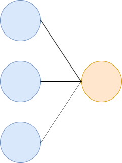

## Lecture Overview
Linear algebra is the theoretical framework that allows us to manipulate and understand data.

This lecture will introduce the basic concepts of vectors and matrices, which are fundamental to many areas of data science, including machine learning, computer vision, and natural language processing.


## Lecture Objectives

Understand

- Vector and matrix operations
- Vector spaces, spans, linear independence, basis, dimension, and subspaces
- Inner products and norms
- Rank, determinant, and invertibility
- How a neural network uses matrix operations for forward propagation

## Vectors

Recall the definition of a column vector:
$$
x =
\begin{bmatrix}
x_1 \\
x_2 \\
\vdots \\
x_m
\end{bmatrix},
$$

where the $i$th element of the vector is denoted $x_i$.

We will shortly learn to interpret vectors as elements of a **vector space**.

---

Let $x = \begin{bmatrix} 1 \\ 2 \end{bmatrix}$ and $y = \begin{bmatrix} 4 \\ 1 \end{bmatrix}$.

A linear combination of $x$ and $y$ is any vector of the form:
$$
\alpha x + \beta y = \alpha \begin{bmatrix} 1 \\ 2 \end{bmatrix} + \beta \begin{bmatrix} 4 \\ 1 \end{bmatrix} = \begin{bmatrix} \alpha + 4\beta \\ 2\alpha + \beta \end{bmatrix},
$$
where $\alpha, \beta \in \mathbb{R}$.

---

Let $x = \begin{bmatrix} 1 \\ 2 \end{bmatrix}$ and $y = \begin{bmatrix} 4 \\ 1 \end{bmatrix}$ with $\alpha=\beta=1$, then the linear combination is
$$
\alpha x + \beta y = \begin{bmatrix} 1 \\ 2 \end{bmatrix} + \begin{bmatrix} 4 \\ 1 \end{bmatrix} =  \begin{bmatrix} 5 \\ 3 \end{bmatrix}.
$$

---

The sum is plotted in @fig-vector-addition. It is obtained by the parallelogram rule: equivalently, place the tail of one vector at the tip of the other.

```{python}
#| label: fig-vector-addition
#| fig-cap: "Vector addition"
import matplotlib.pyplot as plt
import numpy as np
fig = plt.figure()
ax = plt.gca()
u = np.array([1, 2])
v = np.array([4, 1])
w = np.array([5, 3])
V = np.array([u, v, w])
origin = np.array([[0, 0, 0], [0, 0, 0]])
plt.quiver(*origin, V[:, 0], V[:, 1],
           color=['r', 'r', 'b'],
           angles='xy',
           scale_units='xy',
           scale=1)
ax.set_xlim([-1, 6])
ax.set_ylim([-1, 4])
ax.text(1.3, 1.9, '$x$', size=16)
ax.text(4.3, 1.2, '$y$', size=16)
ax.text(5.3, 2.9, '$x+y$', size=16)
plt.plot([1, 5], [2, 3], 'g--')
plt.plot([4, 5], [1, 3], 'g--')
ax.grid()
plt.show()
```

## Span

Let $S = \{v_{1}, \ldots, v_{n}\}$ be a set of vectors where $v_i\in\mathbb{R}^m$. The $\operatorname{span}(S)$ is the set of all linear combinations of vectors in the set $S$.

$$
\operatorname{span}(S) = \left\{ \sum_{i=1}^{n} \alpha_i v_i \;\middle|\; \alpha_i \in \mathbb{R} \right\}.
$$

::: {.notes}
Use $x = [1, 2]$ and $y = [4, 1]$. Their span is all of $\mathbb{R}^{2}$.

Mention $\mathbb{R}^{n}$.
:::

## Matrices

Recall that a matrix with $m$ rows and $n$ columns, $A\in\mathbb{R}^{m\times n}$, is a 2-D array of numbers
$$
\small
A =
\begin{bmatrix}
a_{11} & a_{12} & \cdots & a_{1n} \\
a_{21} & a_{22} & \cdots & a_{2n} \\
\vdots & \vdots & \ddots & \vdots \\
a_{m1} &a_{m2} & \cdots & a_{mn} \\
\end{bmatrix}.
$$

The element at row $i$ and column $j$ is denoted $a_{ij}$. A column vector is a matrix of size $m\times 1$.

Matrices represent *linear transformations*.

---

The transpose, $A^{\top}$, of a matrix $A\in\mathbb{R}^{m\times n}$ is the $n\times m$ matrix

$$
\small
A^{\top} =
\begin{bmatrix}
a_{11} & a_{21} & \cdots & a_{m1} \\
a_{12} & a_{22} & \cdots & a_{m2} \\
\vdots & \vdots & \ddots & \vdots \\
a_{1n} &a_{2n} & \cdots & a_{mn} \\
\end{bmatrix}.
$$

The transpose of a column vector $x$ is a row vector. A row vector is a matrix of size $1\times m$.

A matrix is *square* when $m=n$.

A square matrix is *symmetric* if $A=A^{\top}$.

::: {.notes}
Mention the importance of symmetric matrices.

Symmetry plays a huge role in linear algebra, in particular the study of eigenvalues, and in optimization.

Write an example.
:::

---

Let $A, B \in \mathbb{R}^{m \times n}$ be two matrices of the same shape. The sum $A + B$ is defined by adding corresponding entries:

$$
(A + B)_{ij} = A_{ij} + B_{ij}.
$$

---

**Example**

::: {.notes}
$$
A = \begin{bmatrix}
1 & 2 \\
3 & 4
\end{bmatrix},
\quad
B = \begin{bmatrix}
5 & 6 \\
7 & 8
\end{bmatrix},
\quad
A + B = \begin{bmatrix}
6 & 8 \\
10 & 12
\end{bmatrix}
$$
:::

## Inner Products

The inner product of two column vectors $x, y\in\mathbb{R}^m$ is the product of the transpose of $x$ by $y$

$$
x^{\top}y = \sum_{i=1}^{m}x_iy_i.
$$

The notation $(x, y) = x^{\top}y$ is also used to denote the inner product.

::: {.notes}
Mention that an inner product is a more general idea and can be extended to work for functions. This leads to the ideas of orthogonal function and function spaces which are hugely important in quantum mechanics, signal processing, and machine learning.

Show a picture of row vector times column vector.
:::

---

The Euclidean length of $x$ is denoted $\Vert x \Vert_2$ and is the square root of the inner product of $x$ with itself

$$
\Vert x \Vert_2 = \sqrt{x^{\top}x} = \left(\sum_{i=1}^{m}\vert x_i\vert^{2}\right)^{1/2}.
$$

The cosine of the angle $\theta$ between $x$ and $y$ can be expressed in terms of the inner product:

$$
\cos(\theta) = \frac{x^{\top}y}{\Vert x\Vert_2 \Vert y\Vert_2}.
$$

::: {.notes}
Reference word embeddings.
:::

## A Single Neuron

{fig-align="center"}

---

A single neuron takes an input $x\in\mathbb{R}^{n}$, weights it with $w\in\mathbb{R}^{n}$, adds a bias $b\in\mathbb{R}$, and applies a nonlinear activation function $\sigma$

$$
a = \sigma(w^{\top}x + b).
$$

The quantity $w^{\top}x = \sum_{j=1}^{n}w_jx_j$ is precisely the inner product of the weights with the input.

::: {.notes}
This is the formula from Lecture 1, for a single neuron. One neuron is one inner product.

The inner product measures how well the input aligns with the weights.
:::

## Matrix-Vector Multiplication

If $x\in\mathbb{R}^{n}$ and $A\in\mathbb{R}^{m\times n}$, then the matrix-vector product $b=Ax\in\mathbb{R}^{m}$ is defined as

$$
b_{i} = \sum_{j=1}^{n}a_{ij}x_j, \quad i=1,\ldots,m.
$$

::: {.notes}
Each entry is an inner product between a row of $A$ and the vector $x$.
:::

---

Let $a_j\in\mathbb{R}^{m}$ denote the $j$th column of $A$, then

$$
b = \sum_{j=1}^{n}x_j a_{j}.
$$

::: {.notes}
Draw a picture of linear combinations of the columns of $A$.
:::

---

Let $x\in\mathbb{R}^{m}$ and $A\in\mathbb{R}^{m\times n}$, how can you interpret $x^{\top}A$?

---

The map $x \rightarrow Ax$ is linear, i.e.,

$$
\begin{align*}
A(x + y) &= Ax + Ay \\
A(\alpha x) &= \alpha A x
\end{align*}
$$

## A Layer of Neurons

{fig-align="center"}

---

Now stack $m$ neurons, each with its own weight vector. Placing the weights of neuron $i$ in row $i$ of $W\in\mathbb{R}^{m\times n}$, the whole layer is a single matrix-vector product

$$
a = \sigma(Wx + b), \qquad a_{i} = \sigma\left(\sum_{j=1}^{n}w_{ij}x_j + b_i\right),
$$

where $b\in\mathbb{R}^{m}$ and $\sigma$ is applied element-wise.

Entry $i$ of $Wx$ is the inner product of row $i$ of $W$ with $x$, so a layer is just $m$ neurons evaluated at once.

::: {.notes}
This is the formula from the very first slide of Lecture 1. We now have the vocabulary to read every symbol in it.
:::

## Matrix-Matrix Multiplication

Matrix-matrix multiplication is a way to combine two matrices to produce a new matrix. If $A \in \mathbb{R}^{m \times n}$ and $B \in \mathbb{R}^{n \times p}$, their product $C = AB$ is an $m \times p$ matrix defined by:

$$
c_{ij} = \sum_{k=1}^{n} a_{ik} b_{kj},
$$

for $i = 1, \ldots, m$ and $j = 1, \ldots, p$.

Each entry $c_{ij}$ is an inner product of row $i$ of $A$ and column $j$ of $B$.

---

Alternatively:

- Column $j$ of $C$ is a linear combination of the columns of $A$ with coefficients coming from column $j$ of $B$.
- Row $i$ of $C$ is a linear combination of the rows of $B$ with coefficients coming from row $i$ of $A$.

---

**Example:**

Let
$$
A = \begin{bmatrix}
1 & 2 \\
3 & 4
\end{bmatrix}, \quad
B = \begin{bmatrix}
5 & 6 \\
7 & 8
\end{bmatrix}.
$$

::: {.notes}
$$
AB = \begin{bmatrix}
1 \cdot 5 + 2 \cdot 7 & 1 \cdot 6 + 2 \cdot 8 \\
3 \cdot 5 + 4 \cdot 7 & 3 \cdot 6 + 4 \cdot 8
\end{bmatrix}
= \begin{bmatrix}
19 & 22 \\
43 & 50
\end{bmatrix}
$$
:::

## Batches in Neural Networks

In practice we do not feed the network one input at a time.

Collect $p$ inputs as the columns of

$$
X = \begin{bmatrix} x_1 & x_2 & \cdots & x_p \end{bmatrix} \in \mathbb{R}^{n\times p},
$$

then the entire batch is pushed through the layer with a single matrix-matrix product

$$
Z = WX \in \mathbb{R}^{m\times p}.
$$

---

Column $k$ of $Z$ is $Wx_k$, the pre-activation of the $k$th input.

So the three operations are the same idea at three scales:

- one neuron, one input: an inner product $w^{\top}x$
- one layer, one input: a matrix-vector product $Wx$
- one layer, a batch of inputs: a matrix-matrix product $WX$

::: {.notes}
This is why GPUs are so effective for deep learning. Batching turns many matrix-vector products into one matrix-matrix product, which is far better suited to parallel hardware.
:::

## Some Special Matrices

We introduce a few important square matrices:

- **Identity matrix**: $I$ has ones on the diagonal and zeros elsewhere.
- **Diagonal matrix**: All off-diagonal entries are zero; only the diagonal may be nonzero.
- **Lower triangular matrix**: All entries above the diagonal are zero.
- **Upper triangular matrix**: All entries below the diagonal are zero.
- **Symmetric matrix**: $A = A^{\top}$; entries are mirrored across the diagonal.

---

### Identity Matrix
The $m \times m$ identity matrix $I$ is defined as

$$
I =
\begin{bmatrix}
1 & 0 & \cdots & 0 \\
0 & 1 & \cdots & 0 \\
\vdots & \vdots & \ddots & \vdots \\
0 & 0 & \cdots & 1
\end{bmatrix},
$$

where all diagonal entries are $1$ and all off-diagonal entries are $0$.

---

### Diagonal Matrix
A diagonal matrix is an $m \times m$ square matrix in which all entries off the main diagonal are zero. That is, for a matrix $D \in \mathbb{R}^{m \times m}$,

$$
D =
\begin{bmatrix}
d_{11} & 0      & \cdots & 0      \\
0      & d_{22} & \cdots & 0      \\
\vdots & \vdots & \ddots & \vdots \\
0      & 0      & \cdots & d_{mm}
\end{bmatrix},
$$

where $d_{ii}$ are the diagonal entries, and $d_{ij} = 0$ for $i \neq j$.

---

### Lower Triangular Matrix

A lower triangular matrix is a square matrix where all entries above the main diagonal are zero. For $L \in \mathbb{R}^{m \times m}$,

$$
L =
\begin{bmatrix}
l_{11} & 0      & \cdots & 0      \\
l_{21} & l_{22} & \cdots & 0      \\
\vdots & \vdots & \ddots & \vdots \\
l_{m1} & l_{m2} & \cdots & l_{mm}
\end{bmatrix},
$$

where $l_{ij} = 0$ for $i < j$.

---

### Upper Triangular Matrix

An upper triangular matrix is a square matrix where all entries below the main diagonal are zero. For $U \in \mathbb{R}^{m \times m}$,

$$
U =
\begin{bmatrix}
u_{11} & u_{12} & \cdots & u_{1m} \\
0      & u_{22} & \cdots & u_{2m} \\
\vdots & \vdots & \ddots & \vdots \\
0      & 0      & \cdots & u_{mm}
\end{bmatrix},
$$

where $u_{ij} = 0$ for $i > j$.

---

### Symmetric Matrices

A symmetric matrix is a square matrix that is equal to its transpose, i.e., $A = A^{\top}$. This means $a_{ij} = a_{ji}$ for all $i, j$.

**Example:**

$$
A =
\begin{bmatrix}
2 & 3 & 4 \\
3 & 5 & 6 \\
4 & 6 & 8
\end{bmatrix}.
$$

Here, $A$ is symmetric because $a_{ij} = a_{ji}$ for all $i, j$.

---

**Questions**

1. What happens to a vector $x$ when we multiply it with the identity matrix?
1. What happens to a vector $x$ when we multiply it with a diagonal matrix?
1. What happens to a matrix $A\in\mathbb{R}^{m\times m}$ when we multiply it with the identity matrix?
1. What happens to a matrix $A\in\mathbb{R}^{m\times m}$ when we multiply it with a diagonal matrix?

## Vector Spaces

An important concept in linear algebra is the notion of a vector space. A vector space is a set $V$ such that for any two elements $u,v\in V$, and any scalars, $\alpha$ and $\beta$, then $\alpha u + \beta v\in V$.

We also need these properties:

1. $u + (v + w) = (u + v) + w$ (associativity).
1. $u + v = v + u$ (commutativity).
1. There exists $0\in V$ such that $v + 0 = v$ for all $v\in V$ (identity element).
1. For every $v\in V$, there exists $-v\in V$ such that $v + (-v) = 0$ (inverse).
1. $\alpha(\beta v) = (\alpha\beta)v$.
1. $1v = v$.
1. $\alpha(u + v) = \alpha u + \alpha v$.
1. $(\alpha + \beta)v = \alpha v + \beta v$.

::: {.notes}
Mention that a vector space doesn't just have to be vectors! It works for matrices and polynomials!
:::

---

Vector spaces give us the framework to define:

- Linear combinations and span
- Linear independence
- Basis and dimension
- Subspaces

Together, these concepts are fundamental for understanding solutions to linear systems, transformations, projections, and many algorithms in data science and machine learning.

## Linear Independence

The set of vectors $S = \{v_{1}, \ldots, v_{n}\}$ is **linearly dependent** if there exist scalars $\alpha_1, \ldots, \alpha_n$, not all zero, such that

$$
\alpha_1 v_1 + \cdots + \alpha_n v_n = 0.
$$

::: {.notes}
Let $v_{1}=[2, 4]$ and $v_{2}=[1, 2]$, then $v_{1}-2v_{2} = 0$.
:::

---

The vectors in $S$ are **linearly independent** if they are not linearly dependent, i.e., the equation
$$
\alpha_1 v_1 + \cdots + \alpha_n v_n = 0,
$$
is only satisfied when $\alpha_i = 0$ for $i=1,\ldots,n$.

::: {.notes}
Give standard basis as example for $\mathbb{R}^{2}$ and $[1, 1]$ and $[1, -1]$.
:::

---

**Linear Independence Example**

Consider the vectors $v_1 = \begin{bmatrix} 1 \\ 2 \end{bmatrix}$ and $v_2 = \begin{bmatrix} 3 \\ 4 \end{bmatrix}$.

Are they linearly independent?

Suppose $\alpha_1 v_1 + \alpha_2 v_2 = 0$:

$$
\alpha_1 \begin{bmatrix} 1 \\ 2 \end{bmatrix} + \alpha_2 \begin{bmatrix} 3 \\ 4 \end{bmatrix} = \begin{bmatrix} 0 \\ 0 \end{bmatrix}.
$$

::: {.notes}
This gives the system:
$$
\begin{cases}
\alpha_1 + 3\alpha_2 = 0 \\
2\alpha_1 + 4\alpha_2 = 0
\end{cases}
$$

Solving, we find $\alpha_1 = 0$, $\alpha_2 = 0$ is the only solution, so the vectors are linearly independent.
:::


## Basis

A **basis** for a vector space $V$ is a linearly independent set of vectors that spans $V$.

The number of vectors in a basis is called the **dimension** of the vector space.

---

Let $e_{k}\in\mathbb{R}^{n}$ denote a vector with a 1 in the $k$-th entry and zero everywhere else, then

$$
\{e_1, \ldots, e_n\}
$$

is called the standard basis.

---

**Example**
A basis for $\mathbb{R}^3$ is any set of three linearly independent vectors. The standard basis is:

$$
\left\{
\begin{bmatrix}
1 \\
0 \\
0
\end{bmatrix},
\begin{bmatrix}
0 \\
1 \\
0
\end{bmatrix},
\begin{bmatrix}
0 \\
0 \\
1
\end{bmatrix}
\right\}.
$$

---

Any set of three linearly independent vectors in $\mathbb{R}^3$ forms a basis. For example,

$$
\left\{
\begin{bmatrix}
1 \\
2 \\
0
\end{bmatrix},
\begin{bmatrix}
0 \\
1 \\
1
\end{bmatrix},
\begin{bmatrix}
1 \\
0 \\
1
\end{bmatrix}
\right\}.
$$

---

Suppose that we have a set of four vectors in $\mathbb{R}^{3}$. Are these vectors linearly independent?

::: {.notes}
No, four vectors in $\mathbb{R}^3$ cannot be linearly independent. The maximum number of linearly independent vectors in $\mathbb{R}^3$ is three, which is the dimension of the space. Any set of four vectors in $\mathbb{R}^3$ must be linearly dependent.
:::

## Subspaces

A **subspace** of a vector space $V$ is a subset $W \subseteq V$ that is itself a vector space under the same addition and scalar multiplication as $V$. That is, for any $u, v \in W$ and any scalar $\alpha$, both $u + v \in W$ and $\alpha u \in W$.

---

**Examples of subspaces:**

- The set of all vectors in $\mathbb{R}^3$ lying on a plane through the origin.
- The set $\{ 0 \}$ (the zero vector) is a subspace of any vector space.
- The column space of a matrix $A\in\mathbb{R}^{m\times n}$ is a subspace of $\mathbb{R}^m$.

A subspace must always contain the zero vector and be closed under addition and scalar multiplication.

## Rank

The column rank of a matrix is the dimension of its column space.

The row rank of a matrix is the dimension of its row space.

**Theorem:** Row rank always equals column rank.

We refer to this single number as the rank of a matrix.

A matrix $A\in\mathbb{R}^{m\times n}$ of full rank is one that has the maximal possible rank, i.e., $\min(m, n)$.

## Determinant

The determinant of a square matrix $A\in\mathbb{R}^{m\times m}$ is obtained by expanding along any fixed row $i$,

$$
\operatorname{det}(A) = \sum_{j=1}^{m}(-1)^{i+j}a_{ij}M_{ij},
$$

where $M_{ij}=\operatorname{det}(A_{ij})$ and $A_{ij}$ is the $(m-1)\times(m-1)$ matrix obtained by removing the $i$th row and the $j$th column.

::: {.notes}

We compute the determinant of the matrix:

$$
A = \begin{bmatrix}
1 & 2 & 3 \\
0 & 4 & 5 \\
1 & 0 & 6
\end{bmatrix}
$$

Using cofactor expansion along the first row:

$$
\begin{align*}
\operatorname{det}(A) &= 1 \cdot \begin{vmatrix} 4 & 5 \\ 0 & 6 \end{vmatrix}
- 2 \cdot \begin{vmatrix} 0 & 5 \\ 1 & 6 \end{vmatrix}
+ 3 \cdot \begin{vmatrix} 0 & 4 \\ 1 & 0 \end{vmatrix} \\
&= 1(4 \cdot 6 - 0 \cdot 5) - 2(0 \cdot 6 - 1 \cdot 5) + 3(0 \cdot 0 - 1 \cdot 4) \\
&= 1(24) - 2(-5) + 3(-4) \\
&= 24 + 10 - 12 \\
&= 22
\end{align*}
$$

:::

## Invertible Matrices

A nonsingular or invertible matrix is a square matrix of full rank.

The inverse of an invertible matrix $A$ is denoted by $A^{-1}$ and satisfies $AA^{-1} = A^{-1}A = I$, where $I$ is the identity matrix.

---

**Example**
Let
$$
A = \begin{bmatrix}
2 & 1 \\
1 & 1
\end{bmatrix}.
$$

The inverse of $A$ is
$$
A^{-1} = \begin{bmatrix}
1 & -1 \\
-1 & 2
\end{bmatrix}.
$$

::: {.notes}
Check:
$$
A A^{-1} = \begin{bmatrix}
2 & 1 \\
1 & 1
\end{bmatrix}
\begin{bmatrix}
1 & -1 \\
-1 & 2
\end{bmatrix}
=
\begin{bmatrix}
2 \cdot 1 + 1 \cdot (-1) & 2 \cdot (-1) + 1 \cdot 2 \\
1 \cdot 1 + 1 \cdot (-1) & 1 \cdot (-1) + 1 \cdot 2
\end{bmatrix}
=
\begin{bmatrix}
1 & 0 \\
0 & 1
\end{bmatrix}
= I
$$
:::

---

For a $2\times 2$ matrix
$$
A = \begin{bmatrix}
a & b \\
c & d
\end{bmatrix},
$$
the inverse is given by
$$
A^{-1} = \frac{1}{ad - bc}
\begin{bmatrix}
d & -b \\
-c & a
\end{bmatrix},
$$
provided that $ad - bc \neq 0$.

---

Note that $(A^{\top})^{-1} = A^{-\top}$. Why?

::: {.notes}
$(AA^{-1})^{\top} = (A^{-1})^{\top}A^{\top} = I$

Mention the students will prove $(AB)^{\top} = B^{\top}A^{\top}$ in homework.
:::

---

**Theorem**

For $A\in\mathbb{R}^{m\times m}$ the following conditions are equivalent:

1. $A$ has an inverse $A^{-1}$
1. $\operatorname{rank}(A) = m$
1. $\operatorname{range}(A) = \mathbb{R}^{m}$
1. $\operatorname{null}(A) = \{0\}$
1. $0$ is not an eigenvalue of $A$
1. $0$ is not a singular value of $A$
1. $\operatorname{det}(A) \neq 0$

## Outer Products

The outer product of a column vector $u\in\mathbb{R}^{m}$ with a column vector $v\in\mathbb{R}^{n}$ is the $m\times n$ (rank 1) matrix $uv^{\top}$

$$
\begin{bmatrix}
u_1 \\
u_2 \\
\vdots \\
u_m
\end{bmatrix}
\begin{bmatrix}
v_1 & v_2 & \cdots & v_n
\end{bmatrix}
=
\begin{bmatrix}
u_1v_1 & u_1v_2 & \cdots & u_1v_n \\
u_2v_1 & u_2v_2 & \cdots & u_2v_n \\
\vdots & \vdots & \ddots & \vdots \\
u_mv_1 & u_mv_2 & \cdots & u_mv_n \\
\end{bmatrix}.
$$

::: {.notes}
Demo a simple outer product $[1, 2]$ and $[3, 4]$. Write the $uv^{\top}$ notation.
:::

---

**Example**
Let $u = \begin{bmatrix} 2 \\ 3 \end{bmatrix}$ and $v = \begin{bmatrix} 4 \\ 5 \end{bmatrix}$.

The outer product $uv^{\top}$ is:

::: {.notes}
$$
\begin{bmatrix}
2 \\
3
\end{bmatrix}
\begin{bmatrix}
4 & 5
\end{bmatrix}
=
\begin{bmatrix}
2 \times 4 & 2 \times 5 \\
3 \times 4 & 3 \times 5
\end{bmatrix}
=
\begin{bmatrix}
8 & 10 \\
12 & 15
\end{bmatrix}
$$
:::


## Vector Norms

The notions of size and distance in a vector space are captured by norms.

A norm is a function $\Vert\cdot\Vert: \mathbb{R}^{m} \rightarrow \mathbb{R}$ that assigns a length to each vector. This function satisfies for all vectors $x,y$

1. $\Vert x \Vert \geq 0$, and $\Vert x\Vert = 0$ only if $x=0$
1. $\Vert x + y \Vert \leq \Vert x \Vert + \Vert y \Vert$
1. $\Vert \alpha x \Vert = \vert \alpha\vert \Vert x \Vert$

## p-norms

The most important class of vector norms are the p-norms

$$
\Vert x \Vert_{p} = \left( \sum_{i=1}^{m}\vert x_i\vert^{p}\right)^{1/p}.
$$

---

When $p=2$ we have the Euclidean distance:

$$
\Vert x \Vert_{2} = \left( \sum_{i=1}^{m}\vert x_i\vert^{2}\right)^{1/2}.
$$

---

```{python}
#| label: fig-2-norm
#| fig-cap: "Unit Ball under the 2-Norm"
import numpy as np
import matplotlib.pyplot as plt

# Create points on the boundary of the unit ball under 2-norm
theta = np.linspace(0, 2 * np.pi, 500)
x = np.cos(theta)
y = np.sin(theta)

# Plot the boundary and fill the interior
plt.figure(figsize=(8, 8))
plt.fill(x, y, color='grey', alpha=0.5)
plt.plot(x, y, color='black')

# Darken the x and y axis lines
plt.axhline(0, color='black', linewidth=2)
plt.axvline(0, color='black', linewidth=2)

plt.title('Unit Ball under 2-Norm')
plt.xlabel('x')
plt.ylabel('y')
plt.grid(True)
plt.axis('equal')
plt.show()
```

---

When $p=1$ we have the Manhattan distance:

$$
\Vert x \Vert_{1} = \sum_{i=1}^{m}\vert x_i\vert.
$$

---

```{python}
#| label: fig-1-norm
#| fig-cap: "Unit Ball under 1-Norm"
import numpy as np
import matplotlib.pyplot as plt

# Define the vertices of the unit ball under 1-norm (diamond shape)
x_1norm = np.array([0, 1, 0, -1, 0])
y_1norm = np.array([1, 0, -1, 0, 1])

# Plot the boundary and fill the interior
plt.figure(figsize=(8, 8))
plt.fill(x_1norm, y_1norm, color='grey', alpha=0.5)
plt.plot(x_1norm, y_1norm, color='black')

# Darken the x and y axis lines
plt.axhline(0, color='black', linewidth=2)
plt.axvline(0, color='black', linewidth=2)

plt.title('Unit Ball under 1-Norm')
plt.xlabel('x')
plt.ylabel('y')
plt.grid(True)
plt.axis('equal')
plt.show()
```

---

When $p\rightarrow\infty$ we have the infinity norm:
$$
\Vert x \Vert_{\infty} = \max_{1\leq i \leq m} \vert x_i\vert.
$$

---

```{python}
#| label: fig-inf-norm
#| fig-cap: "Unit Ball under the Infinity-Norm"
import numpy as np
import matplotlib.pyplot as plt

# Define the vertices of the unit ball under infinity norm (square shape)
x_inf = np.array([1, 1, -1, -1, 1])
y_inf = np.array([1, -1, -1, 1, 1])

# Plot the boundary and fill the interior
plt.figure(figsize=(8, 8))
plt.fill(x_inf, y_inf, color='grey', alpha=0.5)
plt.plot(x_inf, y_inf, color='black')

# Darken the x and y axis lines
plt.axhline(0, color='black', linewidth=2)
plt.axvline(0, color='black', linewidth=2)

plt.title('Unit Ball under Infinity-Norm')
plt.xlabel('x')
plt.ylabel('y')
plt.grid(True)
plt.axis('equal')
plt.show()

```

## SPD Matrices

A symmetric matrix $B$ is positive definite (SPD) if

$$
x^{\top}Bx > 0\quad \forall x\neq 0.
$$


A symmetric matrix $B$ is positive semidefinite if

$$
x^{\top}Bx \geq 0\quad \forall x\neq 0.
$$

If $B$ is SPD then $\Vert x\Vert_{B} = \sqrt{x^{\top}Bx}$ is a well-defined norm.

::: {.notes}
This is the weighted norm. It measures length after reweighting the coordinates.
:::

## Cauchy-Schwarz and H&ouml;lder Inequalities

Let $p$ and $q$ satisfy $\frac{1}{p} + \frac{1}{q} = 1$, with $1\leq p,q\leq \infty$, then the H&ouml;lder inequality states that for any vectors $x$ and $y$

$$
\vert x^{\top}y\vert \leq \Vert x\Vert_{p}\Vert y\Vert_{q}.
$$

The Cauchy-Schwarz inequality is a special case when $p=q=2$:

$$
\vert x^{\top}y\vert \leq \Vert x\Vert_{2}\Vert y\Vert_{2}.
$$

## Matrix Norms Induced by Vector Norms

Let $A\in\mathbb{R}^{m\times n}$, the induced matrix norm is defined as

$$
\Vert A \Vert_{(m,n)} = \sup_{x\in\mathbb{R}^{n},~x\neq 0}\frac{\Vert Ax\Vert_{(m)}}{\Vert x\Vert_{(n)}}.
$$

It measures the *stretch factor* of $A$ in a way that generalizes vector norms.

::: {.notes}
Mention that matrix norms are an essential tool for

1. convergence analysis of algorithms
1. regularization terms
1. bounding errors
1. measuring sensitivity to changes in input
:::

---

The following are commonly used matrix norms

1. $\Vert A \Vert_1 = \max_{1\leq j\leq n}\sum_{i=1}^{m} \vert a_{ij}\vert$
1. $\Vert A \Vert_2 = \sigma_{\text{max}}(A)$, where $\sigma_{\text{max}}(A)$ is the largest singular value ^[We will cover singular values in later lectures.].
1. $\Vert A \Vert_\infty = \max_{1\leq i\leq m}\sum_{j=1}^{n} \vert a_{ij}\vert$

::: {.notes}
1. 1-norm is max column sum
1. Infinity norm is max row sum
:::

---

```{python}
#| label: fig-matrix-2-norm
#| fig-cap: "Image of the unit ball under the matrix 2-norm"
import numpy as np
import matplotlib.pyplot as plt

# Define the matrix
A = np.array([[1, 2], [0, 2]])

# Define the unit circle
theta = np.linspace(0, 2 * np.pi, 100)
unit_circle = np.array([np.cos(theta), np.sin(theta)])

# Transform the unit circle using the matrix A
transformed_circle = A @ unit_circle

# Find the vector on the unit circle that is amplified the most
u, s, vh = np.linalg.svd(A)
max_vector = vh[0]

# Transform the max vector
transformed_max_vector = A @ max_vector

# Plot the original unit circle
plt.plot(unit_circle[0], unit_circle[1], 'b--', label='Unit Circle')

# Plot the transformed unit circle
plt.plot(transformed_circle[0], transformed_circle[1], 'r-', label='Transformed Unit Circle')

# Plot the max vector and its transformed image
plt.plot([0, max_vector[0]], [0, max_vector[1]], 'g-', label='Max Vector')
plt.plot([0, transformed_max_vector[0]], [0, transformed_max_vector[1]], 'k-', label='Transformed Max Vector')

# Add labels and legend
plt.xlabel('x')
plt.ylabel('y')
plt.axhline(0, color='black',linewidth=0.5)
plt.axvline(0, color='black',linewidth=0.5)
plt.grid(color = 'gray', linestyle = '--', linewidth = 0.5)
plt.legend()
plt.title('Image of the Unit Ball under the Matrix 2-Norm')
plt.axis('equal')

# Show the plot
plt.show()
```

## Frobenius Norm

The Frobenius norm is defined as

$$
\Vert A \Vert_F = \left(\sum_{j=1}^{n}\sum_{i=1}^{m}\vert a_{ij}\vert^{2}\right)^{1/2} = \left(\sum_{j=1}^{n}\Vert a_{j}\Vert_{2}^{2}\right)^{1/2}.
$$

For a square matrix, the trace is the sum of the diagonal entries, $\operatorname{tr}(A) = \sum_{i=1}^{m}a_{ii}$.


$$
\Vert A \Vert_F = \sqrt{\operatorname{tr}(A^{\top}A)} = \sqrt{\operatorname{tr}(AA^{\top})}.
$$

## Condition Number

The condition number of a matrix is

$$
\kappa(A) = \Vert A \Vert \Vert A^{-1} \Vert.
$$

It is a measure of how sensitive the solution of a linear system is to changes in the input.

::: {.notes}
Mention that this tells you how numerically stable your computations are. You can expect to lose $\log(\kappa(A))$ digits in a computation.
:::

## Complex Numbers

As data scientists we predominantly work with the set of real numbers $\mathbb{R}$.

However, the theoretical results that we discuss in this course work also apply for the set of complex numbers $\mathbb{C}$, i.e., numbers of the form $z=a+ib$, where $i=\sqrt{-1}$.

The conjugate of a complex number is $\bar{z} = a-ib$. For real numbers $\bar{z}=z$.

---

For vectors and matrices with complex numbers, we use the $^{*}$ notation to indicate the Hermitian conjugate. Given

$$
A =
\begin{bmatrix}
a_{11} & a_{12}\\
a_{21} & a_{22}\\
a_{31} & a_{32}\\
\end{bmatrix},
$$
the Hermitian conjugate is
$$
A^{*} = \bar{A}^{\top} =
\begin{bmatrix}
\bar{a}_{11} & \bar{a}_{21} & \bar{a}_{31}\\
\bar{a}_{12} & \bar{a}_{22} & \bar{a}_{32}\\
\end{bmatrix}
$$

## Summary

- Reviewed vectors and matrices
- Explained matrix operations
- Defined inner products and outer products
- Saw how a neural network uses matrix operations for forward propagation
- Introduced some special matrices
- Reviewed vector spaces and their properties
- Reviewed linear independence, span, basis, and dimension
- Defined subspaces
- Introduced rank, the determinant, and invertible matrices
- Reviewed vector norms and matrix norms
