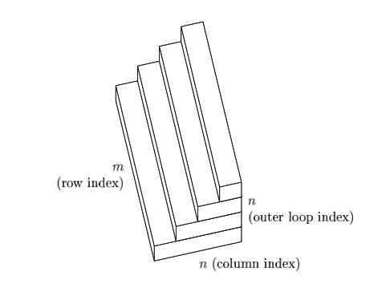

## Lecture Overview

The QR factorization is one of the most important ideas in all of numerical linear algebra.

It underpins the *stable* computation of least squares problems.

This lecture will provide an understanding of how to compute the QR factorization.


## Lecture Objectives

- Review:
  - orthogonal vectors/matrices
  - projectors
- Reduced and Full QR factorization
- Classical and modified Gram-Schmidt algorithms
- Computational complexity of QR factorization

## Proof by Mathematical Induction

Suppose that we want to prove a claim or observation that starts with  *For all $n \in \mathbb{N}$*, (or equivalent).

We can approach such proof as follows: 

- first we check that the claim holds for 0,
- then we show that for all $n \in \mathbb{N}$ that if the proposition is true for $n$, then it is also true for $n+1$.

## Mathematical Induction Steps

Every proof by induction contains the following three steps:

1. Base case
1. Induction hypothesis
1. Induction Step

---

**Example**

We are going to prove that for all $n \in \mathbb{N}$,
$$
\sum_{k=0}^{n} 2k = 0 + 2 + 4 + \dots + 2n = n(n+1).
$$

::: {.notes}
Base case: $n=0.$

Induction hypothesis: Let $n \in \mathbb{N}$ be arbitrary and fixed. Suppose $0 + 2 + 4 + \dots + 2n = n(n+1)$ holds.

Induction step: For $n+1$ we obtain
$$
\begin{align*}
    & 0 + 2 + 4 + \dots + 2n + 2(n+1) \\
    & = \left( 0 + 2 + 4 + \dots + 2n \right) + 2(n+1) \\
    & = n(n+1) + 2(n+1) = (n+1)(n+2).
\end{align*}
$$
:::

## Orthogonal

Two vectors $q_1$ and $q_2$ are orthogonal when

$$
q_{2}^{\top}q_1 = 0.
$$

A set of vectors $S = \{q_1, q_2, \ldots, q_n \}$ are orthogonal if every pair of vectors is orthogonal, i.e.,

$$
q_{i}^{\top}q_{j} = 0 \quad \text{for all} \quad i\neq j.
$$

:::: {.fragment}
What is the difference between orthogonal and orthonormal vectors?
::::

## Orthogonal Vectors

Let $q_{1}=\begin{bmatrix} 1 \\ 2 \end{bmatrix}$ and $q_{2}= \begin{bmatrix} 2 \\ -1 \end{bmatrix}$. 

:::: {.fragment}
Are these vectors orthogonal?
::::

:::: {.fragment}
Are these vectors orthonormal?
::::

:::: {.fragment}
How could we make them orthonormal?
::::

## Orthogonal Matrices

A matrix $Q\in\mathbb{R}^{m\times m}$ is orthogonal if $Q^{\top}Q = QQ^{\top} = I$.

:::: {.fragment}
What does this imply about $Q^{-1}$?
::::

---

The matrix

$$
G =
\begin{bmatrix}
\cos{\theta} & -\sin{\theta} \\
\sin{\theta} & \cos{\theta}
\end{bmatrix}
$$

that rotates 2-D vectors counterclockwise by an angle of $\theta$ is an example of an orthogonal matrix.

---

```{python}
import numpy as np
import matplotlib.pyplot as plt

def create_rotation_matrix(angle):
    angle_rad  = np.pi*angle/180
    matrix = np.array([[np.cos(angle_rad), -np.sin(angle_rad)],
                       [np.sin(angle_rad), np.cos(angle_rad)]])
    return matrix

def rotate_vector(vector, angle):
    matrix = create_rotation_matrix(angle)
    return matrix @ vector

def rotate_vectors(vector, angles):
    vectors = []
    for angle in angles:
        rotated_vector = rotate_vector(vector, angle)
        vectors.append(rotated_vector)
    return vectors

def extract_coordinates(vectors):
    x_coords = np.zeros(len(vectors))
    y_coords = np.zeros(len(vectors))
    for i, vector in enumerate(vectors):
        x_coords[i] = vector[0]
        y_coords[i] = vector[1]
    return x_coords, y_coords


plt.xlim(-1, 1)
plt.ylim(-1, 1)
plt.grid()
colors = [
    "crimson", "teal", "gold", "indigo", "coral", 
    "limegreen", "orchid", "sienna", "dodgerblue", "plum",
    "turquoise", "magenta"
]

vector = np.array([1, 0])
angles = [0, 30, 60, 90, 120, 150, 180, 210, 240, 270, 300, 330]

vectors = rotate_vectors(vector, angles)
x_coords, y_coords = extract_coordinates(vectors)

for i, (x, y) in enumerate(zip(x_coords, y_coords)):
  plt.plot([0, x], [0, y], color=colors[i], label=f"{angles[i]}°")
plt.legend(title="Rotation Angle", bbox_to_anchor=(1.05, 1), loc='upper left')
plt.show()
```

---

The matrix 

$$
H =
\begin{bmatrix}
-1 & 0 \\
0 & 1
\end{bmatrix}
$$

reflects 2-D vectors across the y-axis and is also orthogonal.

---

```{python}
import numpy as np
import matplotlib.pyplot as plt

H = np.array([[-1, 0],
        [ 0, 1]])

vector = np.array([2, 1])
reflected_vector = H @ vector

plt.figure()
plt.grid()
plt.plot([0, vector[0]], [0, vector[1]], color="blue", label=r"$v = [2, 1]$")
plt.plot([0, reflected_vector[0]], [0, reflected_vector[1]], color="red", label=r"$Hv=[-2,1]$")
plt.legend()
plt.title("Reflection Across the y-axis")
plt.show()
```

## QR Factorization

Today we will discuss how we can take a matrix $A\in\mathbb{R}^{m\times n}$ and produce a factorization of the form

$$
A = \hat{Q}\hat{R},
$$

where $\hat{Q}\in\mathbb{R}^{m\times n}$ has orthonormal columns and $\hat{R}\in\mathbb{R}^{n\times n}$ is upper triangular.

---

For many applications we are interested in the successive column spaces of a matrix $A$, i.e.,

$$
\langle a_1 \rangle \subseteq \langle a_1, a_2 \rangle \subseteq \langle a_1, a_2, a_3 \rangle \subseteq \ldots,
$$

where $\langle \cdots \rangle$ denotes the subspace spanned by the vectors within the bracket.

The idea behind the QR factorization is to construct a sequence of orthogonal vectors such that

$$
\langle q_1, q_2, \ldots, q_j \rangle = \langle a_1, a_2, \ldots, a_j \rangle,~\text{for}~j=1,\ldots, n.
$$

---

Let $A\in\mathbb{R}^{m\times n}$ and $\hat{Q}$ denote the matrix whose columns are $q_{j}$.
In order for $\hat{Q}$ to span the successive columns spaces of $A$, we must have

$$
\scriptsize
\begin{bmatrix}
 & & & \\
 & & & \\
 a_{1} & a_2 & \cdots & a_{n} \\
 & & & \\
  & & &
\end{bmatrix}
=
\begin{bmatrix}
 & & & \\
 & & &\\
 q_{1} & q_2 & \cdots & q_{n} \\
 & & & \\
& & & \\
\end{bmatrix}
\begin{bmatrix}
 r_{11}& r_{12} &\cdots & r_{1n}  \\
 & r_{22} & \ & \vdots \\
 & & \ddots & \\
 & & & r_{nn}
\end{bmatrix}
$$

---

The previous slide says

$$
\begin{align}
a_{1} &= r_{11}q_1 \\
a_{2} &= r_{12}q_1 + r_{22}q_2  \\
a_{3} &= r_{13}q_1 + r_{23}q_2 + r_{33}q_3 \\
&\vdots \\
a_{n} &= r_{1n}q_1 + r_{2n}q_2 + \cdots + r_{nn}q_{n}.
\end{align}
$$

---

As a matrix formula this is

$$
A = \hat{Q}\hat{R},
$$
where $\hat{Q}\in\mathbb{R}^{m\times n}$ with orthonormal columns and $\hat{R}\in\mathbb{R}^{n\times n}$ is an upper triangular matrix.

This is a *reduced QR factorization* of $A$.

Using what we learned about orthogonality from last class, we will derive a systematic way to produce this factorization.

## Gram-Schmidt Orthogonalization

How do we construct our vectors $q_{j}$? 

Recall from the previous lecture that we can express a vector in the following form

$$
v_{j} = a_{j} - (q_{1}^{\top}a_{j})q_{1} - (q_{2}^{\top}a_{j})q_{2} - \cdots - (q_{j-1}^{\top}a_{j})q_{j-1}.
$$

If we divide $v_{j}$ by $\Vert v_{j}\Vert_2$, then we have an orthonormal $q_{j}$. If we have repeated this process $j$ times, then $q_{j}\in\langle a_{1}\ldots, a_{j} \rangle$ and by construction is orthonormal to $q_1,\ldots q_{j-1}$. 

---

The previous set of equations for the vectors $a_{j}$ can be rewritten as

$$
\begin{align*}
q_{1} &= \frac{a_{1}}{r_{11}} \\
q_{2} &= \frac{a_{2}-r_{12}q_{1}}{r_{22}} \\
&\vdots \\
q_{n} &= \frac{a_{n}-\sum_{i=1}^{n-1}r_{in}q_{i}}{r_{nn}}.
\end{align*}
$$

---

Based on the previous slide and the formula

$$
v_{j} = a_{j} - (q_{1}^{\top}a_{j})q_{1} - (q_{2}^{\top}a_{j})q_{2} - \cdots - (q_{j-1}^{\top}a_{j})q_{j-1}.
$$

we know that

$$
r_{ij} = q_{i}^{\top}a_{j}\quad (i< j),
$$

and

$$
\vert r_{jj}\vert = \left\Vert a_{j} - \sum_{i=1}^{j-1}r_{ij}q_{i} \right\Vert_{2}.
$$


## Classical Gram-Schmidt 

Let's combine the previous slides into an algorithm

**Algorithm**

1. for $j=1,\ldots, n$
1. $\quad v_{j} = a_{j}$
1. $\quad\quad$ for $i=1,\ldots, j-1$
1. $\quad\quad\quad r_{ij} = q_{i}^{\top}a_{j}$ 
1. $\quad\quad\quad v_{j} = v_{j} - r_{ij}q_{i}$
1. $\quad\quad r_{jj} = \Vert v_{j}\Vert_2$ 
1. $\quad\quad q_{j} = v_{j}/r_{jj}$ 


## Example

Let's work out a $3\times 3$ example of QR factorization using the Classical Gram-Schmidt (CGS) algorithm.

Let
$$
A = \begin{bmatrix}
2 & 0 & 1 \\
1 & 1 & 0 \\
0 & 1 & 2
\end{bmatrix}.
$$

We apply the CGS algorithm step-by-step.

---

### Step 1

Initialize $Q$ and $R$ as zero matrices.

$$
Q=
\begin{bmatrix}
0 & 0 & 0 \\
0 & 0 & 0 \\
0 & 0 & 0 \\
\end{bmatrix},\quad
R =
\begin{bmatrix}
0 & 0 & 0 \\
0 & 0 & 0 \\
0 & 0 & 0 \\
\end{bmatrix}.
$$

---

### Step 2 (j=1)

Set $v_{1}=\begin{bmatrix}2 \\ 1 \\ 0 \end{bmatrix}$.

Compute $r_{11} = \Vert v_{1}\Vert_{2}$

Compute $q_{1} = v_{1}/r_{11}$

---

$$
Q=
\begin{bmatrix}
\frac{2}{\sqrt{5}} & 0 & 0 \\
\frac{1}{\sqrt{5}} & 0 & 0 \\
0 & 0 & 0 \\
\end{bmatrix},\quad
R =
\begin{bmatrix}
\sqrt{5} & 0 & 0 \\
0 & 0 & 0 \\
0 & 0 & 0 \\
\end{bmatrix}.
$$

---

### Step 3 (j=2, i=1)

Set $v_{2}=\begin{bmatrix}0 \\ 1 \\ 1 \end{bmatrix}$.

Compute $r_{12} = q_{1}^{\top}a_{2}$

Compute $v_{2} = v_{2} - r_{12}q_{1}$.

Compute $r_{22} = \Vert v_{2}\Vert_{2}$

Compute $q_{2} = v_{2}/r_{22}$

---

$$
Q=
\begin{bmatrix}
\frac{2}{\sqrt{5}} & -\frac{2\sqrt{5}}{15} & 0 \\
\frac{1}{\sqrt{5}} & \frac{4\sqrt{5}}{15} & 0 \\
0 & \frac{\sqrt{5}}{3} & 0 \\
\end{bmatrix},\quad
R =
\begin{bmatrix}
\sqrt{5} & \frac{1}{\sqrt{5}} & 0 \\
0 & \frac{3}{\sqrt{5}} & 0 \\
0 & 0 & 0 \\
\end{bmatrix}.
$$

---

### Step 3 (j=3, i=1)

Set $v_{3}=\begin{bmatrix}1 \\ 0 \\ 2 \end{bmatrix}$.

Compute $r_{13} = q_{1}^{\top}a_{3}$

Compute $v_{3} = v_{3} - r_{13}q_{1}$.

---

### Step 3 (j=3, i=2)

Compute $r_{23} = q_{2}^{\top}a_{3}$

Compute $v_{3} = v_{3} - r_{23}q_{2}$.

---

### Step 3 (j=3, i=3)

Compute $r_{33} = \Vert v_{3}\Vert_{2}$

Compute $q_{3} = v_{3}/r_{33}$.

---

We have

$$
Q=
\begin{bmatrix}
\frac{2}{\sqrt{5}} & -\frac{2\sqrt{5}}{15} & \frac{1}{3} \\
\frac{1}{\sqrt{5}} & \frac{4\sqrt{5}}{15} & -\frac{2}{3}\\
0 & \frac{\sqrt{5}}{3} & \frac{2}{3} \\
\end{bmatrix},\quad
R =
\begin{bmatrix}
\sqrt{5} & \frac{1}{\sqrt{5}} & \frac{2}{\sqrt{5}} \\
0 & \frac{3}{\sqrt{5}} & \frac{8\sqrt{5}}{15} \\
0 & 0 & \frac{15}{9} \\
\end{bmatrix}.
$$


## Full QR Factorization

A full QR factorization of $A\in\mathbb{R}^{m\times n} (m\geq n)$ is denoted by

$$
A = QR,
$$

where $Q\in\mathbb{R}^{m\times m}$ is orthogonal and $R\in\mathbb{R}^{m\times n}$ is upper triangular.

The matrix $Q$ is created by appending an additional $m-n$ orthonormal columns to $\hat{Q}$.

The matrix $R$ is created by appending $m$ rows of zeros to $\hat{R}$.

## Existence and Uniqueness

All matrices have QR factorizations and under suitable restrictions they are unique.

**Theorem (Existence)**

Every $A\in\mathbb{R}^{m\times n} (m\geq n)$ has a full QR factorization, hence also a reduced QR factorization.

**Theorem (Uniqueness)**

Each $A\in\mathbb{R}^{m\times n} (m\geq n)$ of full rank has a unique reduced QR factorization $A=\hat{Q}\hat{R}$ with $r_{jj}>0$.

## Gram-Schmidt Projections

The CGS method is not numerically stable. However, we can modify this method to produce a numerically stable algorithm.

The key idea behind this is projections. 

We will show that

$$
q_{1} = \frac{P_{1}a_{1}}{\Vert P_1a_{1}\Vert_2}, q_{2} = \frac{P_{2}a_{2}}{\Vert P_2a_{2}\Vert_2}, \ldots, q_{n} = \frac{P_{n}a_{n}}{\Vert P_{n}a_{n}\Vert_2},
$$

where each $P_{j}$ is an orthogonal projector.

---

Recall the following formula

$$
v_{j} = a_{j} -\sum_{i=1}^{j-1}(q_{i}^{\top}a_{j})q_{i}.
$$

Let's consider the case when $j=2$.

---

Observe that
$$
v_{2} = a_{2} - (q_{1}^{\top}a_{2})q_{1} = (I-q_{1}q_{1}^{\top})a_{2}.
$$

The projector $(I-q_{1}q_{1}^{\top})$ eliminates the component of $a_2$ in the direction of $q_{1}$.

---

For the general case we have that

$$
v_{j} = \left(I - \sum_{i=1}^{j-1}q_{i}q_{i}^{\top}\right)a_{j} = P_{j}a_{j},
$$

and normalizing gives $q_{j} = v_{j}/\Vert v_{j}\Vert_2$, matching the formula above.


---

Define

$$
Q_{j-1}
=
\begin{bmatrix}
& & \\
& & \\
q_{1} & \cdots & q_{j-1} \\
& & \\
& & \\
\end{bmatrix},
$$

where each column is orthonormal.

---

The MGS projection operators are defined as
$$
P_{j} = I - Q_{j-1}Q_{j-1}^{\top},
$$

where $Q_{j-1}$ is the matrix of orthonormal columns.

Recall the notation $P_{\perp q_{j}} = I - q_{j}q_{j}^{\top}$, then we can construct $P_{j}$ as a product of projectors

$$
P_{j} = P_{\perp q_{j-1}}\cdots P_{\perp q_{2}}P_{\perp q_{1}}.
$$

## Modified Gram-Schmidt

**Algorithm**

1. for $i=1,\ldots, n$
1. $\quad v_{i} = a_{i}$
1. for $i=1,\ldots, n$
1. $\quad r_{ii} = \Vert v_{i}\Vert_{2}$
1. $\quad q_{i} = v_{i}/r_{ii}$
1. $\quad\quad$ for $j=i+1,\ldots, n$
1. $\quad\quad\quad r_{ij} = q_{i}^{\top}v_{j}$ 
1. $\quad\quad\quad v_{j} = v_{j} - r_{ij}q_{i}$

---

:::: {.columns}
::: {.column width="47.5%"}
**CGS Algorithm**

1. for $j=1,\ldots, n$
1. $\quad v_{j} = a_{j}$
1. $\quad\quad$ for $i=1,\ldots, j-1$
1. $\quad\quad\quad r_{ij} = q_{i}^{\top}a_{j}$ 
1. $\quad\quad\quad v_{j} = v_{j} - r_{ij}q_{i}$
1. $\quad\quad r_{jj} = \Vert v_{j}\Vert_2$ 
1. $\quad\quad q_{j} = v_{j}/r_{jj}$ 
:::
::: {.column width="5%"}
:::
::: {.column width="47.5%"}
**MGS Algorithm**

1. for $i=1,\ldots, n$
1. $\quad v_{i} = a_{i}$
1. for $i=1,\ldots, n$
1. $\quad r_{ii} = \Vert v_{i}\Vert_{2}$
1. $\quad q_{i} = v_{i}/r_{ii}$
1. $\quad\quad$ for $j=i+1,\ldots, n$
1. $\quad\quad\quad r_{ij} = q_{i}^{\top}v_{j}$ 
1. $\quad\quad\quad v_{j} = v_{j} - r_{ij}q_{i}$
:::
::::

## Stability

Recall that an orthogonal matrix $Q$ satisfies 
$$
Q^{\top}Q = QQ^{\top} = I.
$$

In the code cell below I create a random matrix of dimension $1000 \times 1000$ and compute the QR factorizations using the CGS and MGS methods.

The 2 norm of $\Vert I - Q^{\top}Q\Vert_{2}$ is printed to the screen.  

```{python}
import numpy as np

def classical_gram_schmidt(A):
    """Perform classical Gram-Schmidt orthogonalization on the columns of A."""
    n_rows, n_cols = A.shape
    Q = np.zeros_like(A)

    for i in range(n_cols):
        # Start with the original column
        q = A[:, i]
        for j in range(i):
            # Subtract the projection onto previous orthogonal vectors
            q -= np.dot(Q[:, j], A[:, i]) * Q[:, j]
        # Normalize the vector
        norm = np.linalg.norm(q)
        if norm < 1e-10:
            raise ValueError("The input matrix has linearly dependent columns.")
        Q[:, i] = q / norm
        
    return Q

def modified_gram_schmidt(A):
    """Perform modified Gram-Schmidt orthogonalization on the columns of A."""
    A = np.array(A, dtype=float)
    n_rows, n_cols = A.shape
    Q = np.zeros_like(A)

    for i in range(n_cols):
        # Start with the i-th column
        q = A[:, i].copy()
        for j in range(i):
            # Subtract projection of q onto previously computed orthogonal vector
            r = np.dot(Q[:, j], q)
            q -= r * Q[:, j]
        # Normalize the resulting vector
        norm = np.linalg.norm(q)
        if norm < 1e-10:
            raise ValueError("Input contains linearly dependent columns.")
        Q[:, i] = q / norm

    return Q

rng = np.random.default_rng(seed=42)

A = rng.random((500, 500))
Q_cgs = classical_gram_schmidt(A)
Q_mgs = modified_gram_schmidt(A)

error_cgs = np.linalg.norm(np.eye(500) - Q_cgs.T @ Q_cgs)
error_mgs = np.linalg.norm(np.eye(500) - Q_mgs.T @ Q_mgs)

print("Orthogonality error (Classical Gram-Schmidt):", error_cgs)
print("Orthogonality error (Modified Gram-Schmidt):", error_mgs)
```


## MGS Operation Count

:::: {.columns}
::: {.column width="50%"}
1. for $i=1,\ldots, n$
1. $\quad v_{i} = a_{i}$
1. for $i=1,\ldots, n$
1. $\quad r_{ii} = \Vert v_{i}\Vert_{2}$
1. $\quad q_{i} = v_{i}/r_{ii}$
1. $\quad\quad$ for $j=i+1,\ldots, n$
1. $\quad\quad\quad r_{ij} = q_{i}^{\top}v_{j}$ 
1. $\quad\quad\quad v_{j} = v_{j} - r_{ij}q_{i}$
:::
::: {.column width="50%"}
Inner loop flops

* Line 7: $m$ multiplications and $m-1$ additions 
* Line 8: $m$ subtractions and $m$ multiplications

This is a total of $\sim 4m$ operations.
:::
::::

---

There are 2 nested loops so we have

$$
\sum_{i=1}^{n}\sum_{j=i+1}^{n}4m \sim \sum_{i=1}^{n}(n-i)4m \sim 2mn^{2}.
$$

## Counting Operations Geometrically

We can always count operations algebraically. However, let's consider a geometric approach.

At the first step in the outer loop (Step 6), the MGS algorithm operates on the whole $m\times n$ matrix.

At the second step, we operate on a submatrix with $m$ rows, but $n-1$ columns.

---

Repeating this process leads to the following figure.

{fig-align="center"}

The operation count is proportional to the volume of this figure. The constant of proportionality is 4 flops.

---

As $m,n\rightarrow\infty$ what shape does this figure approach?

:::: {.fragment}
A right triangular prism with an area of $mn^{2}/2$.
::::

:::: {.fragment}
Multiplying by 4 yields $2mn^{2}$.
::::

## Gram-Schmidt as Triangular Orthogonalization

Each outer step of the MGS algorithm can be interpreted as a right-multiplication by a square upper triangular matrix

$$
\scriptsize
\begin{bmatrix}
& & & \\
& & & \\
v_{1} & v_{2} & \cdots & v_{n} \\
& & &  \\
& &  & \\
\end{bmatrix}
\begin{bmatrix}
\frac{1}{r_{11}}&\frac{-r_{12}}{r_{11}} &\frac{-r_{13}}{r_{11}} &\cdots \\
& 1& & \\
& & 1&  \\
& &  &\ddots \\
\end{bmatrix}
=
\begin{bmatrix}
& & & \\
& & & \\
q_{1} & v_{2}^{(2)} & \cdots & v_{n}^{(2)} \\
& & &  \\
& &  & \\
\end{bmatrix}
$$

---

At step $i$ of the MGS algorithm subtracts $r_{ij}/r_{ii}$ times column $i$ of the current A from columns $>i$ and replaces column $i$ by $1/r_{ii}$ times itself. These operations define the upper-triangular matrices $R_{i}$. 

Shown below are the matrices when $i=2,3$
$$
\scriptsize
R_{2} =
\begin{bmatrix}
1 & &  & \\
& \frac{1}{r_{22}}&\frac{-r_{23}}{r_{22}} &\cdots \\
& &1 & \\
& &  &\ddots \\
\end{bmatrix},
\quad
R_{3} =
\begin{bmatrix}
1 & &  & \\
 & 1 & & \\ 
& & \frac{1}{r_{33}} &\cdots \\
& &  &\ddots \\
\end{bmatrix},
$$

---

At the end of the process we have

$$
A\underbrace{R_{1}R_{2}\cdots R_{n}}_{\hat{R}^{-1}} = \hat{Q}.
$$

This shows that the Gram-Schmidt algorithm is a method of triangular orthogonalization.

## Summary

Today we learned about two approaches for generating the QR factorization

- Classical Gram-Schmidt (numerically unstable)
- Modified Gram-Schmidt (numerically stable)

The importance of projection matrices was fundamental to the MGS approach.

We also determined the computational complexity of this algorithm.