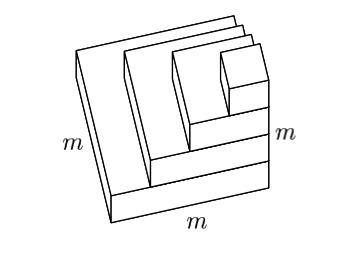

## Lecture Overview

Solving linear systems of equations is fundamental to the study of linear algebra. 

The problem of solving a linear system of equations is: given $A\in\mathbb{R}^{m\times m}, b\in\mathbb{R}^{m}$ find the vector $x\in\mathbb{R}^{m}$ satisfying:

$$
Ax = b.
$$

The simplest way to solve a system of equations is by Gaussian elimination.

## Lecture Objectives

Understand:

- The LU factorization
- Solving linear systems of equations via the LU factorization
- Solving linear systems of equations via the QR factorization
- Partial pivoting

## Linear Systems of Equations
Consider the following system of equations with two unknowns $x_{1}$ and $x_{2}$:

$$
\begin{cases}
2x_{1} + 3x_{2} = 8, \\
x_{1} - 4x_{2} = -7.
\end{cases}
$$

This can be written in matrix form as:

$$
\begin{bmatrix}
2 & 3 \\
1 & -4
\end{bmatrix}
\begin{bmatrix}
x_{1} \\
x_{2}
\end{bmatrix}
=
\begin{bmatrix}
8 \\
-7
\end{bmatrix}.
$$

## Gaussian Elimination for $A\in\mathbb{R}^{2\times 2}$
To solve the previous equation we would:

1. Eliminate $x_1$ from the second equation.
2. Solve for $x_2$ from the second equation.
3. Substitute $x_2$ into the first equation to solve for $x_1$.

---

**Elimination**

::: {.notes}
Subtract $\ell_{21} = \frac{1}{2}$ times equation 1 from equation 2:

$$
\left(x_{1} - 4x_{2}\right) - \frac{1}{2}\left(2x_{1} + 3x_{2}\right) = -7 - \frac{1}{2}(8)
\quad\Longrightarrow\quad
-\frac{11}{2}x_{2} = -11.
$$

In matrix form this is

$$
\begin{bmatrix}
2 & 3 \\
0 & -\frac{11}{2}
\end{bmatrix}
\begin{bmatrix}
x_{1} \\
x_{2}
\end{bmatrix}
=
\begin{bmatrix}
8 \\
-11
\end{bmatrix}.
$$

**Back-substitution.** From the second equation $x_{2} = 2$. Substituting into the first equation, $2x_{1} + 3(2) = 8$, so $x_{1} = 1$.

Check: $1 - 4(2) = -7$.
:::

---

The elimination of $x_{1}$ from the second equation is equivalent to transforming $A$ to an upper triangular matrix $U$.

Solving for $x_{2}$ and $x_{1}$ is the process of back-substitution. Back-substitution is an efficient way to solve upper triangular systems of equations.

## LU Factorization

Gaussian elimination transforms a full linear system of equations into an upper-triangular one by applying simple linear transformations on the left.

The idea is to transform the square matrix $A\in\mathbb{R}^{m \times m}$ into an upper triangular matrix $U\in\mathbb{R}^{m \times m}$ by introducing zeros below the diagonal starting with column 1, then column 2, until the final column $m$.

---

We will see that this process is equivalent to multiplying $A$ by a sequence of lower triangular matrices $L_{k}\in\mathbb{R}^{m\times m}$ on the left, i.e.,

$$
\underbrace{L_{m-1}\cdots L_{2}L_{1}}_{L^{-1}}A = U \quad \Leftrightarrow \quad A=LU.
$$

## Example

Starting with a $4\times 4$ matrix, this procedure works as follows:

$$
\scriptsize
\begin{bmatrix}
x & x & x & x \\
x & x & x & x \\
x & x & x & x \\
x & x & x & x \\
\end{bmatrix}
\underrightarrow{L_{1}}
\begin{bmatrix}
x & x & x & x \\
0 & x & x & x \\
0 & x & x & x \\
0 & x & x & x \\
\end{bmatrix}
\underrightarrow{L_{2}}
\begin{bmatrix}
x & x & x & x \\
0 & x & x & x \\
0 & 0 & x & x \\
0 & 0 & x & x \\
\end{bmatrix}
\underrightarrow{L_{3}}
\begin{bmatrix}
x & x & x & x \\
0 & x & x & x \\
0 & 0 & x & x \\
0 & 0 & 0 & x \\
\end{bmatrix}.
$$

At the $k$th step, $L_{k}$ introduces zeros below the diagonal in column $k$ by subtracting multiples of row $k$ from rows $k+1,\dots,m$.

---

Let's work with an actual numerical example. Consider the matrix

$$
A = 
\begin{bmatrix}
2 & 1 & 1 & 0 \\
4 & 3 & 3 & 1 \\
8 & 7 & 9 & 5 \\
6 & 7 & 9 & 8\\
\end{bmatrix}.
$$

---

The first step of Gaussian elimination looks like this:

$$
\scriptsize
L_{1}A = 
\begin{bmatrix}
1 & 0 & 0 & 0 \\
-2 & 1 & 0 & 0 \\
-4 & 0 & 1 & 0 \\
-3 & 0 & 0 & 1\\
\end{bmatrix}
\begin{bmatrix}
2 & 1 & 1 & 0 \\
4 & 3 & 3 & 1 \\
8 & 7 & 9 & 5 \\
6 & 7 & 9 & 8\\
\end{bmatrix}
=
\begin{bmatrix}
2 & 1 & 1 & 0 \\
0 & 1 & 1 & 1 \\
0 & 3 & 5 & 5 \\
0 & 4 & 6 & 8\\
\end{bmatrix}
$$

---

The second step of Gaussian elimination looks like this:

$$
\scriptsize
L_{2}L_{1}A = 
\begin{bmatrix}
1 & 0 & 0 & 0 \\
0 & 1 & 0 & 0 \\
0 & -3 & 1 & 0 \\
0 & -4 & 0 & 1\\
\end{bmatrix}
\begin{bmatrix}
2 & 1 & 1 & 0 \\
0 & 1 & 1 & 1 \\
0 & 3 & 5 & 5 \\
0 & 4 & 6 & 8\\
\end{bmatrix}
=
\begin{bmatrix}
2 & 1 & 1 & 0 \\
0 & 1 & 1 & 1 \\
0 & 0 & 2 & 2 \\
0 & 0 & 2 & 4\\
\end{bmatrix}
$$

---

The final step is

$$
\scriptsize
L_{3}L_{2}L_{1}A = 
\begin{bmatrix}
1 & 0 & 0 & 0 \\
0 & 1 & 0 & 0 \\
0 & 0 & 1 & 0 \\
0 & 0 & -1 & 1\\
\end{bmatrix}
\begin{bmatrix}
2 & 1 & 1 & 0 \\
0 & 1 & 1 & 1 \\
0 & 0 & 2 & 2 \\
0 & 0 & 2 & 4\\
\end{bmatrix}
=
\begin{bmatrix}
2 & 1 & 1 & 0 \\
0 & 1 & 1 & 1 \\
0 & 0 & 2 & 2 \\
0 & 0 & 0 & 2\\
\end{bmatrix}
=
U.
$$

---

We have that

$$
\scriptsize
\begin{bmatrix}
1 & 0 & 0 & 0 \\
-2 & 1 & 0 & 0 \\
-4 & 0 & 1 & 0 \\
-3 & 0 & 0 & 1\\
\end{bmatrix}^{-1}
=
\begin{bmatrix}
1 & 0 & 0 & 0 \\
2 & 1 & 0 & 0 \\
4 & 0 & 1 & 0 \\
3 & 0 & 0 & 1\\
\end{bmatrix},
$$

and

$$
\scriptsize
L_{1}^{-1}L_{2}^{-1}L_{3}^{-1}
=
\begin{bmatrix}
1 & 0 & 0 & 0 \\
2 & 1 & 0 & 0 \\
4 & 3 & 1 & 0 \\
3 & 4 & 1 & 1\\
\end{bmatrix}.
$$

---

The final LU factorization is

$$
\begin{bmatrix}
2 & 1 & 1 & 0 \\
4 & 3 & 3 & 1 \\
8 & 7 & 9 & 5 \\
6 & 7 & 9 & 8\\
\end{bmatrix}
=
\begin{bmatrix}
1 & 0 & 0 & 0 \\
2 & 1 & 0 & 0 \\
4 & 3 & 1 & 0 \\
3 & 4 & 1 & 1\\
\end{bmatrix}
\begin{bmatrix}
2 & 1 & 1 & 0 \\
0 & 1 & 1 & 1 \\
0 & 0 & 2 & 2 \\
0 & 0 & 0 & 2\\
\end{bmatrix}.
$$

## General Formulas

Let $x_{k}$ denote the $k$th column of the matrix at the beginning of step $k$. The transformation $L_{k}$ must be chosen so that

$$
x_{k}
=
\begin{bmatrix}
x_{1k} \\
\vdots \\
x_{kk} \\
x_{k+1,k} \\
\vdots \\
x_{mk}
\end{bmatrix}
\rightarrow
\quad
L_{k}x_{k}
=
\begin{bmatrix}
x_{1k} \\
\vdots \\
x_{kk} \\
0 \\
\vdots \\
0 
\end{bmatrix}.
$$

---

To do this we wish to subtract $\ell_{jk}$ times row $k$ from row $j$ where 

$$
\ell_{jk} = \frac{x_{jk}}{x_{kk}}\quad(k<j\leq m).
$$

---

The matrix $L_{k}$ must have the form

$$
L_{k}
=
\begin{bmatrix}
1 & & & & & \\
& \ddots & & & & \\
& & 1 & & & \\
& & -\ell_{k+1,k} & 1 & & \\
& & \vdots &  &\ddots & \\
& & -\ell_{mk} &  & & 1\\
\end{bmatrix}.
$$

## Inverting $L_{k}$

If
$$
\small
\ell_{k} = 
\begin{bmatrix}
0 \\
\vdots \\
0 \\
\ell_{k+1, k} \\
\vdots \\
\ell_{mk}
\end{bmatrix},
$$

then $L_{k} = I-\ell_{k}e_{k}^{\top}$, where $e_{k}$ is the column vector with 1 in position $k$ and $0$ elsewhere.

---

Let's compute $L_{1}$ using this formula from our example.

::: {.notes}
From the first step of the example, $\ell_{21} = 4/2 = 2$, $\ell_{31} = 8/2 = 4$, $\ell_{41} = 6/2 = 3$, so

$$
\ell_{1} =
\begin{bmatrix}
0 \\ 2 \\ 4 \\ 3
\end{bmatrix},
\qquad
\ell_{1}e_{1}^{\top} =
\begin{bmatrix}
0 \\ 2 \\ 4 \\ 3
\end{bmatrix}
\begin{bmatrix}
1 & 0 & 0 & 0
\end{bmatrix}
=
\begin{bmatrix}
0 & 0 & 0 & 0 \\
2 & 0 & 0 & 0 \\
4 & 0 & 0 & 0 \\
3 & 0 & 0 & 0
\end{bmatrix}.
$$

Then

$$
L_{1} = I - \ell_{1}e_{1}^{\top} =
\begin{bmatrix}
1 & 0 & 0 & 0 \\
-2 & 1 & 0 & 0 \\
-4 & 0 & 1 & 0 \\
-3 & 0 & 0 & 1
\end{bmatrix},
$$

which matches $L_{1}$ from the example.
:::

---

Note that $e_{k}^{\top}\ell_{k} = 0$. As a result

$$
\small
L_{k}(I+\ell_{k}e_{k}^{\top})= (I-\ell_{k}e_{k}^{\top})(I+\ell_{k}e_{k}^{\top}) = I - \ell_{k}e_{k}^{\top}\ell_{k}e_{k}^{\top} = I.
$$

This shows that $(I+\ell_{k}e_{k}^{\top})=L_{k}^{-1}$.

## Computing $L$

Using the facts that $(I+\ell_{k}e_{k}^{\top})=L_{k}^{-1}$ and $e_{k}^{\top}\ell_{k+1}=0$, let's compute 

$$
\small
L_{k}^{-1}L_{k+1}^{-1} = (I+\ell_{k}e_{k}^{\top})(I+\ell_{k+1}e_{k+1}^{\top}) = I + \ell_{k}e_{k}^{\top} + \ell_{k+1}e_{k+1}^{\top}.
$$

This shows that the product $L_{k}^{-1}L_{k+1}^{-1}$ is just the unit lower-triangular matrix with the entries of both $L_{k}^{-1}$ and $L_{k+1}^{-1}$ inserted in their usual places below the diagonal.

---

Let's compute $L_{1}^{-1}L_{2}^{-1}$ from our example.

::: {.notes}
From the example, $\ell_{1} = \begin{bmatrix} 0 & 2 & 4 & 3\end{bmatrix}^{\top}$ and $\ell_{2} = \begin{bmatrix} 0 & 0 & 3 & 4\end{bmatrix}^{\top}$. Since $e_{1}^{\top}\ell_{2} = 0$,

$$
L_{1}^{-1}L_{2}^{-1} = I + \ell_{1}e_{1}^{\top} + \ell_{2}e_{2}^{\top}
=
\begin{bmatrix}
1 & 0 & 0 & 0 \\
2 & 1 & 0 & 0 \\
4 & 3 & 1 & 0 \\
3 & 4 & 0 & 1
\end{bmatrix}.
$$

Multiplying the matrices directly gives the same result:

$$
\begin{bmatrix}
1 & 0 & 0 & 0 \\
2 & 1 & 0 & 0 \\
4 & 0 & 1 & 0 \\
3 & 0 & 0 & 1
\end{bmatrix}
\begin{bmatrix}
1 & 0 & 0 & 0 \\
0 & 1 & 0 & 0 \\
0 & 3 & 1 & 0 \\
0 & 4 & 0 & 1
\end{bmatrix}
=
\begin{bmatrix}
1 & 0 & 0 & 0 \\
2 & 1 & 0 & 0 \\
4 & 3 & 1 & 0 \\
3 & 4 & 0 & 1
\end{bmatrix}.
$$
:::

---

As a result

$$
\scriptsize
L = L_{1}^{-1}L_{2}^{-1}\cdots L_{m-1}^{-1} = 
\begin{bmatrix}
1 & & & & \\
\ell_{21} & 1 & & & \\
\ell_{31} & \ell_{32} & 1 & & \\
\vdots & \vdots & \ddots & \ddots & \\
\ell_{m1} & \ell_{m2} & \cdots & \ell_{m,m-1} & 1 \\
\end{bmatrix}.
$$

## Algorithm
**Gaussian Elimination without Pivoting**

1. $U=A$, $L=I$
1. for $k=1,\ldots, m-1$
1. $\quad$ for $j=k+1,\ldots,m$
1. $\quad\quad \ell_{jk} = u_{jk}/u_{kk}$
1. $\quad\quad u_{j,k:m} = u_{j,k:m} - \ell_{jk}u_{k,k:m}$

## Operation Count

The work is dominated by the vector operation in the inner loop $u_{j,k:m} = u_{j,k:m} - \ell_{jk}u_{k,k:m}$, which consists of

- one scalar-vector multiplication 
- one vector subtraction. 

If $l=m-k+1$ is the length of the row vectors, then we have $2l$ flops. 

For each value of $k$, the inner loop is repeated for rows $k+1,\ldots, m$.

---

The work for this procedure corresponds to one layer of the following solid

{fig-align="center"}

As $m\rightarrow\infty$ this solid converges to a pyramid with volume $\frac{1}{3}m^{3}$. 

At 2 flops per unit volume Gaussian elimination requires $\frac{2}{3}m^{3}$ flops.

::: {.notes}
**Reading the figure.** Each unit cube is one entry $u_{ji}$ updated by the inner loop, which costs 2 flops (one multiply, one subtract).

**One layer = one step $k$.** At step $k$ we update rows $k+1,\ldots,m$ ($m-k$ rows), and in each row we update columns $k,\ldots,m$ ($m-k+1$ entries). So layer $k$ is a slab of roughly $(m-k)\times(m-k)$ cubes, one unit thick. The bottom layer ($k=1$) is about $m\times m$.

**Why the layers shrink.** After step $k$, row $k$ of $U$ and column $k$ of $L$ are finished and never touched again. The active submatrix loses one row and one column at every step, so each layer is a slightly smaller square stacked on the previous one. After $m-1$ steps the stack is $m$ high.
:::

## Solution of Ax=b by LU Factorization

Let $A=LU$, then we can write the linear system $Ax=b$ as 

$$
LUx = b.
$$

The method for solving linear systems by LU factorization is

:::: {.incremental}
1. Compute $A=LU$.
1. Solve $Ly = b$ using forward substitution.
1. Solve $Ux=y$ using back substitution.
::::

## Back Substitution

Suppose we wish to solve $Ux = y$, where $U$ is upper triangular, i.e.,

$$
\begin{bmatrix}
 u_{11}& u_{12} &\cdots & u_{1m}  \\
 & u_{22} & \ & \vdots \\
 & & \ddots & \\
 & & & u_{mm}
\end{bmatrix}
\begin{bmatrix}
x_{1}\\
x_{2} \\
\vdots \\
x_{m}\\
\end{bmatrix}
=
\begin{bmatrix}
y_{1}\\
y_{2} \\
\vdots \\
y_{m}\\
\end{bmatrix}.
$$

We can do this by solving for the components of $x$ one after the other, beginning with $x_{m}$ and finishing with $x_{1}$.

---

**Back Substitution Algorithm**

1. $x_{m} = y_{m}/u_{mm}$
1. for $j=m-1,\ldots,1$
1. $\quad x_{j} = \left(y_{j} - \sum_{k=j+1}^{m}x_{k}u_{jk}\right)/u_{jj}$

This algorithm requires $\sim m^{2}$ flops.

## Solution of Ax=b by QR Factorization

Let $A=QR$, then we can write the linear system $Ax=b$ as $QRx = b,$ or

$$
Rx = Q^{\top}b.
$$

The method for solving linear systems by QR factorization is

:::: {.incremental}
1. Compute $A=QR$.
1. Compute $y = Q^{\top}b$.
1. Solve $Rx=y$ using back substitution.
::::

## Pivots

Gaussian elimination in its pure form is unstable. 

The instability can be controlled by permuting the order of the rows of the matrix being operated on. 

This operation is called pivoting and results in the factorization

$$
PA=LU,
$$

where $P$ is a permutation matrix.

---

At step $k$ of Gaussian elimination, multiples of row $k$ are subtracted from rows $k+1,\ldots,m$ of the working matrix $X$ in order to introduce zeros in entry $k$ of these rows.

The entry $x_{kk}$ is called the pivot.

$$
\begin{bmatrix}
x & x & x & x \\
0 & x_{kk} & {\bf x} & {\bf x} \\
0 & x & x & x \\
0 & x & x & x \\
\end{bmatrix}
\rightarrow
\begin{bmatrix}
x & x & x & x \\
0 & x_{kk} & x & x \\
0 & 0 & {\bf x} & {\bf x} \\
0 & 0 & {\bf x} & {\bf x} \\
\end{bmatrix}.
$$

There is no reason why the $k$th row and column must be chosen for the elimination.

## Partial Pivots

Good pivots can be found by just interchanging the rows, which is called partial pivoting.

The pivot at step $k$ is chosen as the entry of largest absolute value among the $m-k+1$ entries on or below the diagonal in column $k$. For example,

$$
\scriptsize
\begin{bmatrix}
x & x & x & x \\
0 & x & x & x \\
0 & x_{ik} & x & x \\
0 & x & x & x \\
\end{bmatrix}
\underrightarrow{P_{k}}
\begin{bmatrix}
x & x & x & x \\
0 & x_{ik} & x & x \\
0 & x & x & x \\
0 & x & x & x \\
\end{bmatrix}
\underrightarrow{L_{k}}
\begin{bmatrix}
x & x & x & x \\
0 & x_{ik} & x & x \\
0 & 0 & x & x \\
0 & 0 & x & x \\
\end{bmatrix}.
$$

## Pivoting Example

Let's work with the previous numerical example to illustrate partial pivoting

$$
A = 
\begin{bmatrix}
2 & 1 & 1 & 0 \\
4 & 3 & 3 & 1 \\
8 & 7 & 9 & 5 \\
6 & 7 & 9 & 8\\
\end{bmatrix}.
$$

---

The first operation is to multiply by the permutation matrix $P_{1}$

$$
\small
\begin{bmatrix}
 &  & 1 &  \\
 & 1 &  &  \\
1 &  &  &  \\
 &  &  & 1\\
\end{bmatrix}
\begin{bmatrix}
2 & 1 & 1 & 0 \\
4 & 3 & 3 & 1 \\
8 & 7 & 9 & 5 \\
6 & 7 & 9 & 8\\
\end{bmatrix}
=
\begin{bmatrix}
8 & 7 & 9 & 5 \\
4 & 3 & 3 & 1 \\
2 & 1 & 1 & 0 \\
6 & 7 & 9 & 8\\
\end{bmatrix}.
$$

---

We now eliminate all the entries below the $(1, 1)$ entry of the matrix:

$$
\small
\begin{bmatrix}
1 &  &  &  \\
-\frac{1}{2} & 1 &  &  \\
-\frac{1}{4} &  & 1 &  \\
-\frac{3}{4} &  &  & 1\\
\end{bmatrix}
\begin{bmatrix}
8 & 7 & 9 & 5 \\
4 & 3 & 3 & 1 \\
2 & 1 & 1 & 0 \\
6 & 7 & 9 & 8\\
\end{bmatrix}
=
\begin{bmatrix}
8 & 7 & 9 & 5 \\
 & -\frac{1}{2} & -\frac{3}{2} & -\frac{3}{2} \\
 & -\frac{3}{4} & -\frac{5}{4} & -\frac{5}{4} \\
 & \frac{7}{4} & \frac{9}{4} & \frac{17}{4} \\
 \end{bmatrix}.
$$

---

Next multiply by permutation matrix $P_{2}$

$$
\small
\begin{bmatrix}
 1 &  &  &  \\
 &  &  & 1 \\
 &  & 1  &  \\
 & 1 &  & \\
\end{bmatrix}
\begin{bmatrix}
8 & 7 & 9 & 5 \\
 & -\frac{1}{2} & -\frac{3}{2} & -\frac{3}{2} \\
 & -\frac{3}{4} & -\frac{5}{4} & -\frac{5}{4} \\
 & \frac{7}{4} & \frac{9}{4} & \frac{17}{4} \\
\end{bmatrix}
=
\begin{bmatrix}
8 & 7 & 9 & 5 \\
 & \frac{7}{4} & \frac{9}{4} & \frac{17}{4} \\
 & -\frac{3}{4} & -\frac{5}{4} & -\frac{5}{4} \\
 & -\frac{1}{2} & -\frac{3}{2} & -\frac{3}{2} \\
\end{bmatrix}.
$$

---

We then eliminate everything below the $(2, 2)$ entry of the matrix:

$$\small
\begin{bmatrix}
1 &  &  &  \\
 & 1 &  &  \\
 & \frac{3}{7} & 1 &  \\
 & \frac{2}{7} &  & 1\\
\end{bmatrix}
\begin{bmatrix}
8 & 7 & 9 & 5 \\
 & \frac{7}{4} & \frac{9}{4} & \frac{17}{4} \\
 & -\frac{3}{4} & -\frac{5}{4} & -\frac{5}{4} \\
 & -\frac{1}{2} & -\frac{3}{2} & -\frac{3}{2} \\
\end{bmatrix}
=
\begin{bmatrix}
8 & 7 & 9 & 5 \\
 & \frac{7}{4} & \frac{9}{4} & \frac{17}{4} \\
 & & -\frac{2}{7} & \frac{4}{7} \\
 &  & -\frac{6}{7} & -\frac{2}{7} \\
\end{bmatrix}.
$$

---

We permute the 3rd and 4th rows

$$
\small
\begin{bmatrix}
1 &  &  &  \\
 & 1 &  &  \\
 &  &   & 1 \\
 &  & 1  & \\
\end{bmatrix}
\begin{bmatrix}
8 & 7 & 9 & 5 \\
 & \frac{7}{4} & \frac{9}{4} & \frac{17}{4} \\
 & & -\frac{2}{7} & \frac{4}{7} \\
 &  & -\frac{6}{7} & -\frac{2}{7} \\
\end{bmatrix}
=
\begin{bmatrix}
8 & 7 & 9 & 5 \\
 & \frac{7}{4} & \frac{9}{4} & \frac{17}{4} \\
  &  & -\frac{6}{7} & -\frac{2}{7} \\
 & & -\frac{2}{7} & \frac{4}{7} \\
\end{bmatrix}.
$$

---

We eliminate the last entry

$$
\small
\begin{bmatrix}
1 &  &  &  \\
 & 1 &  &  \\
 &  & 1 &  \\
 &  & -\frac{1}{3} & 1\\
\end{bmatrix}
\begin{bmatrix}
8 & 7 & 9 & 5 \\
 & \frac{7}{4} & \frac{9}{4} & \frac{17}{4} \\
  &  & -\frac{6}{7} & -\frac{2}{7} \\
 & & -\frac{2}{7} & \frac{4}{7} \\
\end{bmatrix}
=
\begin{bmatrix}
8 & 7 & 9 & 5 \\
 & \frac{7}{4} & \frac{9}{4} & \frac{17}{4} \\
  &  & -\frac{6}{7} & -\frac{2}{7} \\
 & &  & \frac{2}{3} \\
\end{bmatrix}.
$$

---

The final factorization is

$$
\scriptsize
\begin{bmatrix}
 &  & 1 &  \\
 &  &  & 1 \\
 &  1&  &  \\
 1&  &  & \\
\end{bmatrix}
\begin{bmatrix}
2 & 1 & 1 & 0 \\
4 & 3 & 3 & 1 \\
8 & 7 & 9 & 5 \\
6 & 7 & 9 & 8\\
\end{bmatrix}
=
\begin{bmatrix}
1 &  &  &  \\
\frac{3}{4} & 1 &  &  \\
\frac{1}{2} & -\frac{2}{7} & 1 &  \\
\frac{1}{4} & -\frac{3}{7} & \frac{1}{3} & 1\\
\end{bmatrix}
\begin{bmatrix}
8 & 7 & 9 & 5 \\
& \frac{7}{4} & \frac{9}{4} & \frac{17}{4} \\
&  & -\frac{6}{7} & -\frac{2}{7} \\
& &  & \frac{2}{3} \\
\end{bmatrix}.
$$
 

## PA=LU Factorization

At the end of this process we have

$$
L_{m-1}P_{m-1}\cdots L_{2}P_{2}L_{1}P_{1}A = U.
$$

We still need to show that we can rearrange this formula into $PA=LU$.

---

We aim to show that
$$
L_{3}P_{3} L_{2}P_{2}L_{1}P_{1} = L_{3}^{\prime} L_{2}^{\prime}L_{1}^{\prime}P_{3}P_{2}P_{1}.
$$

This will then imply the same is true for the general case.

---

Define 

$$
L_{3}^{\prime} = L_{3}, \quad L_{2}^{\prime} = P_{3}L_{2}P_{3}^{-1}, \quad L_{1}^{\prime} = P_{3}P_{2}L_{1}P_{2}^{-1}P_{3}^{-1}.
$$

Note that $L_{2}^{\prime}$ has the same structure as $L_{2}$. Why?

:::: {.fragment}
The permutation $P_{3}$ only permutes rows and columns with index $\geq 3$, so it just reorders the multipliers below the diagonal in column 2, preserving the structure of $L_{2}$.
::::

---

We compute

$$
\small
\begin{align}
L_{3}^{\prime} L_{2}^{\prime}L_{1}^{\prime}P_{3}P_{2}P_{1} &= 
L_{3}(P_{3}L_{2}P_{3}^{-1})(P_{3}P_{2}L_{1}P_{2}^{-1}P_{3}^{-1})P_{3}P_{2}P_{1} \\ &= L_{3}P_{3} L_{2}P_{2}L_{1}P_{1}.
\end{align}
$$

---

For the general case we have that

$$
(L_{m-1}^{\prime}\cdots L_{2}^{\prime}L_{1}^{\prime})(P_{m-1}\cdots P_{2}P_{1})A = U,
$$

where

$$
L_{k}^{\prime} = P_{m-1}\cdots P_{k+1}L_{k}P_{k+1}^{-1}\cdots P_{m-1}^{-1}.
$$

With $L=(L_{m-1}^{\prime}\cdots L_{2}^{\prime}L_{1}^{\prime})^{-1}$ and $P=P_{m-1}\cdots P_{2}P_{1}$ we obtain 

$$
PA=LU.
$$

## Complete Pivoting

In complete pivoting, we not only permute rows of the matrix, but also the columns. An LU factorization with complete pivoting computes

$$
PAQ = LU,
$$
where $P$ and $Q$ are permutation matrices for the rows and columns, respectively.

## Summary

Gaussian elimination is equivalent to computing an LU factorization of the matrix $A$.

We now know how to solve linear systems of equations using either LU or QR factorization.

We understand what partial pivoting is and why it is used in computing the LU factorization.
