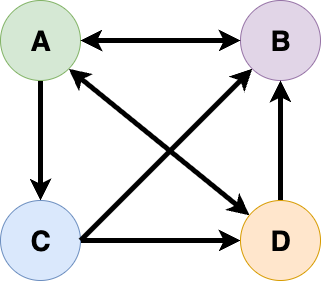

## Lecture Overview

Eigenvalue problems are important in data science. 

They are relevant in applications such as

- Dimensionality reduction
- Anomaly detection
- Spectral clustering
- Connectivity of graphs

## Lecture Objectives

Review the mathematics of the eigenvalue problem.

- Complex numbers
- Eigenvalues and eigenvectors
- The characteristic polynomial
- Algebraic and geometric multiplicity
- Diagonalizability

## Complex Numbers

A complex number $z\in\mathbb{C}$ has the form

$$
z = a +ib,
$$

where $i=\sqrt{-1}$, and $a,b\in\mathbb{R}$.

The conjugate 

$$
\bar{z} = a - ib.
$$

The modulus $\vert z\vert = \sqrt{z\bar{z}} = \sqrt{a^{2} + b^{2}}$.

What does it mean if $z = \bar{z}$?

:::: {.fragment}
$z$ is a real number.
::::


## Eigenvalues and Eigenvectors

Let $A\in\mathbb{C}^{m\times m}$ be a square matrix. A nonzero vector $x\in\mathbb{C}^{m}$ is an *eigenvector* of $A$, and $\lambda\in\mathbb{C}$ is its corresponding *eigenvalue*, if 

$$
Ax=\lambda x.
$$

The action of a matrix $A$ on a subspace $S\subseteq\mathbb{C}^{m}$ can mimic scalar multiplication. The subspace $S$ is called an *eigenspace* and any nonzero $x\in S$ is an eigenvector.

The set of all eigenvalues $\Lambda(A)$ of a matrix $A$ is the *spectrum* of $A$.

---

```{python}
#| fig-align: center
import numpy as np
import matplotlib.pyplot as plt

# Define the matrix
A = np.array([[4, -1], [2, 1]])

# Compute eigenvalues and eigenvectors
eigvals, eigvecs = np.linalg.eig(A)

# Define a non-eigenvector
u = np.array([1, 0])
Au = A @ u

# Prepare the plot
fig, ax = plt.subplots(figsize=(6, 6))
ax.set_xlim(-5, 5)
ax.set_ylim(-5, 5)
ax.set_aspect('equal')
ax.grid(True)
ax.set_title("Eigenvectors and a Non-Eigenvector under $A$")

# Define colors
colors = ['blue', 'green', 'orange', 'purple']

# Plot eigenvectors and their images
for i in range(len(eigvals)):
    v = eigvecs[:, i]
    Av = A @ v
    ax.quiver(0, 0, Av[0], Av[1], angles='xy', scale_units='xy', scale=1,
              color=colors[2*i+1], label=f'$Av_{{{i+1}}}$')
    ax.quiver(0, 0, v[0], v[1], angles='xy', scale_units='xy', scale=1,
              color=colors[2*i], label=f'$v_{{{i+1}}}$')

# Plot non-eigenvector and its image
ax.quiver(0, 0, Au[0], Au[1], angles='xy', scale_units='xy', scale=1,
          color='red', label='$Au$')
ax.quiver(0, 0, u[0], u[1], angles='xy', scale_units='xy', scale=1,
          color='black', label='$u$')

# Add legend with LaTeX formatting
ax.legend(loc='upper left')

# Add a textbox showing matrix A
matrix_text = "A = [[ 4, -1],\n       [ 2,  1]]"
ax.text(0.05, 0.35, matrix_text, transform=ax.transAxes,
        fontsize=14, fontfamily='monospace', verticalalignment='top', bbox=dict(boxstyle="round,pad=0.3", facecolor="lightyellow", edgecolor="gray"))

plt.show()

```

## Determinants

The **determinant** of a square matrix $A\in\mathbb{C}^{m\times m}$, denoted $\det(A)$, is a scalar value that encodes important properties of the matrix.

### $1\times 1$ matrix

Let $A=\begin{bmatrix}a\end{bmatrix}$, then

$$
\det(A) = a.
$$

---

### $2\times 2$ matrix

Let $A=\begin{bmatrix}a & b \\ c & d \end{bmatrix}$, then

$$
\det(A) = ad-bc.
$$

---

Let $A=\begin{bmatrix} 4 & -1 \\ 2 & 1 \end{bmatrix}$. Compute $\det(A)$.

---

### $m\times m$ matrix

Let $A\in\mathbb{C}^{m\times m}$, then for any fixed row $i$,

$$
\det(A) = \sum_{j=1}^{m} (-1)^{i+j} a_{ij} \cdot \det(M_{ij}),
$$

where $M_{ij}$ is the $(m-1)\times(m-1)$ submatrix formed by deleting row $i$ and column $j$ from $A$. The determinant $\det(M_{ij})$ is called a *minor*.

---

Let 

$$
A = \begin{bmatrix}
1 & 2 & 3 \\
0 & 4 & 5 \\
1 & 0 & 6
\end{bmatrix}.
$$

Let's compute $\det(A)$.

::: {.notes}
$$
\begin{align*}
\det(A) &= 1 \cdot \begin{vmatrix} 4 & 5 \\ 0 & 6 \end{vmatrix}
- 2 \cdot \begin{vmatrix} 0 & 5 \\ 1 & 6 \end{vmatrix}
+ 3 \cdot \begin{vmatrix} 0 & 4 \\ 1 & 0 \end{vmatrix} \\
&= 1 \cdot (4 \cdot 6 - 0 \cdot 5)
- 2 \cdot (0 \cdot 6 - 1 \cdot 5)
+ 3 \cdot (0 \cdot 0 - 1 \cdot 4) \\
&= 1 \cdot 24 - 2 \cdot (-5) + 3 \cdot (-4) \\
&= 24 + 10 - 12 = 22
\end{align*}
$$
:::

---

###  Properties
- $\det(A) = 0$ if and only if $A$ is singular (not invertible)
- $\det(AB) = \det(A)\det(B)$ for any $A,B$
- $\det(A^*) = \overline{\det(A)}$
- $\det(cA)= c^{m}\det(A)$ for constant $c$.
- $\det(I) = 1$ for the identity matrix $I$

What is $\det(A^{-1})$?

## Characteristic Polynomial

$\lambda$ is an eigenvalue of $A$ when $Ax = \lambda x$ for some $x\neq 0$, i.e.,

$$
\begin{align*}
&(\lambda I - A)x = 0 \text{ has a nonzero solution} \\
\iff\ &\lambda I - A \text{ is singular} \\
\iff\ &\det(\lambda I - A) = 0.
\end{align*}
$$

The *characteristic polynomial* of $A\in\mathbb{C}^{m\times m}$, denoted $p_{A}$, is the degree $m$ polynomial

$$
p_{A}(z) = \det(zI-A).
$$

---

**Theorem**

$\lambda$ is an eigenvalue of $A$ if and only if $p_{A}(\lambda)=0$.

::: {.callout-note}
You will also see $\det(A-\lambda I)$. Since $\det(A-zI) = (-1)^{m}p_{A}(z)$, it has the same roots. We use $zI-A$ because then $p_{A}$ is *monic*: the coefficient of $z^{m}$ is 1.
:::

## Computing Eigenvalues and Eigenvectors

Let's review the steps to compute the eigenvalues and eigenvectors of a $2\times 2$ matrix.

1. Compute the characteristic polynomial $p_{A}(\lambda) = \det(\lambda I - A)$.
1. Solve $p_{A}(\lambda) = 0$ for the eigenvalues $\lambda$.
1. For each eigenvalue, compute the eigenvector as a nonzero solution of $(A-\lambda I)v = 0$.

---

**Example**
Let $A = \begin{bmatrix} 4 & -1 \\ 2 & 1 \end{bmatrix}$.


---

**Example continued**

## Eigenvalue Decomposition

An eigenvalue decomposition of a square matrix $A$ is a factorization

$$
A = X\Lambda X^{-1}.
$$

The matrix $X$ is nonsingular and $\Lambda$ is diagonal.

---

Equivalently,

$$
AX = X\Lambda,
$$

where

$$
\scriptsize
\begin{bmatrix}
& & & & \\
& & & & \\
& & A & & \\
& & & & \\
& & & & \\
\end{bmatrix}
\begin{bmatrix}
& &   \\
& &   \\
x_{1}& \cdots & x_{m} \\
& &  \\
& &   \\
\end{bmatrix}
=
\begin{bmatrix}
& &   \\
& &   \\
x_{1}& \cdots & x_{m} \\
& &  \\
& &   \\
\end{bmatrix}
\begin{bmatrix}
\lambda_1& & &  \\
&\lambda_2 & &  \\
& & \ddots  & \\
& & & \lambda_m \\
\end{bmatrix}.
$$

---

For $A=\begin{bmatrix} 4 & -1 \\ 2 & 1 \end{bmatrix}$, we have 

$$
A = X \Lambda X^{-1} =
\begin{bmatrix}
1 & 1 \\
2 & 1
\end{bmatrix}
\begin{bmatrix}
2 & 0 \\
0 & 3
\end{bmatrix}
\begin{bmatrix}
-1 & 1 \\
2 & -1
\end{bmatrix}.
$$

## Geometric Multiplicity

The set of eigenvectors corresponding to a single eigenvalue together with the zero vector forms a subspace of $\mathbb{C}^{m}$ called an *eigenspace*.

If $\lambda\in\Lambda(A)$ is an eigenvalue, let us denote the corresponding eigenspace as $E_{\lambda}$.

The eigenspace is invariant under the action of $A$. This means that $AE_{\lambda}\subseteq E_{\lambda}$.

---

The dimension of $E_{\lambda}$ is the maximum number of linearly independent eigenvectors corresponding to the eigenvalue $\lambda$. 

This number is the *geometric multiplicity* of the eigenvalue.

## Two Theorems

**Fundamental Theorem of Algebra**

A polynomial of degree $m$ has exactly $m$ complex roots, counted with multiplicity.

**Complex Conjugate Root Theorem**

If a complex number $z$ is a root of a polynomial with real coefficients, then $\bar{z}$ is also a root.


## Algebraic Multiplicity

Since $p_{A}$ is monic, it can always be factored as

$$
p_{A}(z) = (z-\lambda_1)(z-\lambda_2)\cdots(z-\lambda_{m})
$$

where $\lambda_{j}\in\mathbb{C}$ is an eigenvalue.

The *algebraic multiplicity* of an eigenvalue $\lambda$ of $A$ is its multiplicity as a root of $p_{A}$.

---

**Theorem**

If $A\in\mathbb{C}^{m\times m}$, then $A$ has $m$ eigenvalues, counted with algebraic multiplicity. In particular, if the roots of $p_{A}$ are *simple* (multiplicity 1), then $A$ has $m$ distinct eigenvalues.


## Similarity Transformations

If $X\in\mathbb{C}^{m\times m}$ is nonsingular, then 

$$
A \rightarrow X^{-1}AX,
$$

is called a *similarity transformation*.

Two matrices $A$ and $B$ are *similar* if there is a similarity transformation relating one to the other, i.e.,

$$
B = X^{-1}AX.
$$

---

**Theorem**

If $X$ is nonsingular, then $A$ and $X^{-1}AX$ have the same characteristic polynomial, eigenvalues, and algebraic and geometric multiplicity.

---

**Theorem**

The algebraic multiplicity of an eigenvalue $\lambda$ is at least as great as its geometric multiplicity. 

::: {.notes}
algebraic multiplicity $\geq$ geometric multiplicity
:::


## Defective Eigenvalues and Matrices

An eigenvalue whose algebraic multiplicity exceeds its geometric multiplicity is a *defective eigenvalue*. A matrix that has at least one defective eigenvalue is a *defective matrix*.

::: {.notes}
Nondefective means full set of linearly independent eigenvectors. Defective means that there is not a complete basis of eigenvectors (doesn't span $\mathbb{C}^{m}$).
:::

What is an example of a nondefective matrix?

:::: {.fragment}
A diagonal matrix.
::::

:::: {.fragment}
We will see that the class of nondefective matrices is exactly the class of matrices that have an eigenvalue decomposition.
::::

---

**Example**
The matrix $A=\begin{bmatrix} 1 & 1 \\ 0 & 1 \end{bmatrix}$ is defective.

::: {.notes}
**Eigenvalues:** $A$ is upper triangular, so
$$
p_{A}(z) = \det(zI - A) = \begin{vmatrix} z-1 & -1 \\ 0 & z-1 \end{vmatrix} = (z-1)^{2}.
$$
The only eigenvalue is $\lambda = 1$, with **algebraic multiplicity 2**.

**Eigenspace:** Solve $(A - I)x = 0$:
$$
A - I = \begin{bmatrix} 0 & 1 \\ 0 & 0 \end{bmatrix}
\quad\Rightarrow\quad x_{2} = 0,\ x_{1} \text{ free}.
$$
So $E_{1} = \operatorname{null}(A - I) = \operatorname{span}\left\{\begin{bmatrix} 1 \\ 0 \end{bmatrix}\right\}$, which has dimension 1, so the **geometric multiplicity is 1**.

Algebraic multiplicity (2) > geometric multiplicity (1), so $\lambda = 1$ is defective and $A$ is defective. We only get one linearly independent eigenvector, so the eigenvectors cannot span $\mathbb{C}^{2}$.
:::

## Diagonalizability

**Theorem**

An $m\times m$ matrix $A$ is nondefective if and only if it has an eigenvalue decomposition $A=X\Lambda X^{-1}$.

Another term for nondefective is *diagonalizable*.

## Determinant and Trace

The trace and the determinant are related to the eigenvalues.

The trace of a matrix $A$ is

$$
\operatorname{tr}(A) = \sum_{i=1}^{m}a_{ii}.
$$

Recall from before that $\det(A) = \sum_{j=1}^{m} (-1)^{i+j} a_{ij} \cdot \det(M_{ij})$.

---

**Theorem**

The determinant $\det(A)$ and $\operatorname{tr}(A)$ are equal to the product and the sum of the eigenvalues of $A$, respectively, counted with algebraic multiplicity:

$$
\det(A)=\prod_{j=1}^{m}\lambda_{j}, \quad \operatorname{tr}(A) = \sum_{j=1}^{m} \lambda_{j}.
$$

## Unitary Diagonalization

A matrix is *unitarily diagonalizable* if there exists a decomposition

$$
A = Q\Lambda Q^{*},
$$

where $Q$ is a unitary (orthogonal) matrix and $\Lambda$ is diagonal.


This means that the matrix $A\in\mathbb{C}^{m\times m}$ has $m$ linearly independent eigenvectors, and these can be chosen to be orthonormal.

---

A real symmetric matrix $A\in\mathbb{R}^{m\times m}$ has the property $A=A^{\top}$.

**Theorem**

A real symmetric matrix is unitarily diagonalizable and its eigenvalues are real. The eigenvectors can be chosen to be real, so $A = Q\Lambda Q^{\top}$ with $Q$ a real orthogonal matrix.

::: {.notes}
The complex analogue is a Hermitian matrix, $A = A^{*}$. A complex matrix with $A=A^{\top}$ need not be diagonalizable, e.g., $\begin{bmatrix} 1 & i \\ i & -1\end{bmatrix}$.
:::

---

**Theorem**

A matrix is unitarily diagonalizable if and only if it is *normal*, i.e., $AA^{*} = A^{*}A$.

## PageRank

- Developed by Larry Page and Sergey Brin at Stanford (1996)
- Algorithm used by Google Search to rank web pages
- Based on the idea that **important pages are linked to by many other important pages**

> The web as a graph: pages are nodes, hyperlinks are edges.

## Graphs

A graph is an ordered pair $G=(V,E)$ comprising

- $V$, a set of vertices (nodes)
- $E \subseteq \{(x,y) | x,y\in V~\text{and}~x\neq y \}$, a set of edges (links) between vertices.

A graph can be represented with an adjacency matrix $A$, where $a_{ij}=1$ if node $j$ has a link to node $i$, and $a_{ij}=0$ otherwise.

Column $j$ of $A$ records the outgoing links of node $j$.

If the graph is undirected, then $A=A^{\top}$.

::: {.notes}
Many texts use the transpose convention ($a_{ij}=1$ if $i$ links to $j$). We use columns for outgoing links so that the Google matrix below is just $A$ with each column rescaled.
:::

## PageRank and Eigenvalues

- The web can be represented as a **directed graph** with an **adjacency matrix** $A$.
- From $A$ we form the **Google matrix** $G$.
- PageRank is the **principal eigenvector** (eigenvector corresponding to the eigenvalue of largest modulus) of $G$.

--- 

How do we form $G$?


:::: {.fragment}
Divide each column of $A$ by the number of outgoing links of that node:

$$
g_{ij} = \frac{a_{ij}}{d_{j}}, \quad d_{j} = \sum_{i=1}^{m} a_{ij}.
$$
::::

:::: {.fragment}
::: {.callout-note}
We assume every page has at least one outgoing link ($d_{j}\geq 1$), i.e., there are no *dangling nodes*. Then every column of $G$ sums to 1.
:::
::::

## Google Matrix

:::: {.columns}
::: {.column width="50%"}
{fig-align="center"}
:::
::: {.column width="50%"}
$$
G = 
\begin{bmatrix}
0 & 0 & 1 & \frac{1}{2} \\
\frac{1}{3} & 0 & 0 & 0 \\
\frac{1}{3} & \frac{1}{2} & 0 & \frac{1}{2} \\
\frac{1}{3} & \frac{1}{2} & 0 & 0 \\
\end{bmatrix}
$$
:::
::::

---

Denote the importance of our 4 pages using $x = [x_{1}, x_{2}, x_{3}, x_{4}]^{\top}$, then

$$
\small
\begin{align}
x_{1} &= x_{3} + \frac{1}{2}x_{4}, \\
x_{2} &= \frac{1}{3}x_{1},\\
x_{3} &= \frac{1}{3}x_{1} + \frac{1}{2}x_{2} + \frac{1}{2}x_{4},\\
x_{4} &= \frac{1}{3}x_{1} + \frac{1}{2}x_{2}.
\end{align}
$$


The PageRank vector $x$ is the eigenvector corresponding to eigenvalue 1 of the Google matrix: $Gx=x$.

---

- To guarantee a unique PageRank, a damping factor is added $\tilde{G} = dG + (1-d)E$ where $E_{ij} = \frac{1}{m}$ and $0<d <1$.
- The matrix $\tilde{G}$ is **column stochastic** and all of its entries are positive.
- The **Perron-Frobenius Theorem** guarantees that for the modified Google matrix:
    - 1 is an eigenvalue of multiplicity 1 and all other eigenvalues have modulus less than 1.
    - The eigenvector has all positive entries.
- The power method, i.e., $\tilde{G}^{k}z\rightarrow x$ as $k\rightarrow\infty$ for a starting vector $z$ with positive entries summing to 1, can be used to approximate the PageRank.

::: {.notes}
Damping models a surfer who follows a link with probability $d$ (typically $0.85$) and jumps to a random page otherwise.
:::


## Summary

We learned about

- Eigenvalues and eigenvectors
- Geometric and algebraic multiplicity
- Classes of matrices that are diagonalizable and unitarily diagonalizable
- PageRank as an eigenvalue problem