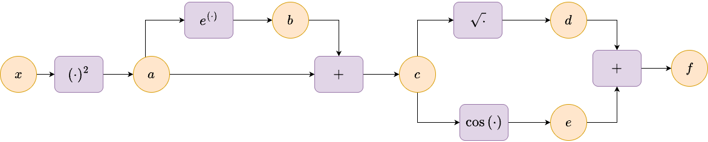
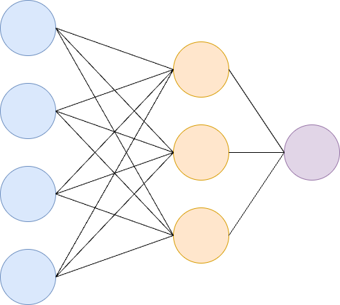

## Lecture Overview

Today we continue our review of derivatives. In particular, derivatives of vector-valued and functions of matrices.

These concepts are essential for understanding back-propagation in deep neural networks.

We also introduce the multivariate version of Taylor's theorem which will be useful in our lectures on optimization.

## Lecture Objectives

Review:

- Derivatives of vector-valued functions  
- Derivatives of matrix-valued functions
- Automatic Differentiation
- Multivariate Taylor's theorem

## Increasing/Decreasing Test

The derivative $f^{\prime}(x)$ gives us information about the function $f(x)$.

1. The function $f(x)$ is increasing when $f^{\prime}(x)>0$.
1. The function $f(x)$ is decreasing when $f^{\prime}(x)<0$.

A critical point is a value $x_{0}$ where $f^{\prime}(x_{0})=0$.

---

**Example:** $f(x)=x^{2}-1$

```{python}
#| fig-align: center
import numpy as np
import matplotlib.pyplot as plt

# Define the function and its derivative
def f(x):
    return x**2 - 1

def df(x):
    return 2*x

x = np.linspace(-3, 3, 400)
y = f(x)
dy = df(x)

# Find where derivative is positive (increasing) and negative (decreasing)
increasing = dy > 0
decreasing = dy < 0

plt.figure(figsize=(8, 5))
plt.plot(x, y, label='$f(x) = x^2 - 1$')
plt.fill_between(x, y, where=increasing, color='green', alpha=0.3, label='Increasing')
plt.fill_between(x, y, where=decreasing, color='red', alpha=0.3, label='Decreasing')
plt.axhline(0, color='gray', lw=0.5)
plt.axvline(0, color='gray', lw=0.5)
plt.legend()
plt.title('Increasing and Decreasing Regions of $f(x) = x^2 - 1$')
plt.xlabel('x')
plt.ylabel('f(x)')
plt.show()

```

## First Derivative Test

The first derivative test gives us a way to determine whether a critical point is a local maximum, minimum, or neither.

If $f^{\prime}(x_0) = 0$ and $f'(x)$ changes sign at $x_0$:

- If $f^{\prime}(x)$ changes from positive to negative at $x_0$, then $f(x_0)$ is a local maximum.
- If $f'(x)$ changes from negative to positive at $x_0$, then $f(x_0)$ is a local minimum.
- If $f'(x)$ does not change sign at $x_0$, then $f(x_0)$ is not a local extremum.

This test is useful for analyzing the behavior of functions near their critical points.

---

**Example:** $f(x)=x^{2}-1$

- What is the critical point $x_{0}$?
- What is the sign change as we pass from negative to positive $x$ values through $x_{0}$?


## Convexity/Concavity Test

The convexity or concavity of a function can be determined using the second derivative.

- If $f^{\prime\prime}(x) > 0$ for all $x$ in an interval, then $f(x)$ is **convex** (curves upwards) on that interval.
- If $f^{\prime\prime}(x) < 0$ for all $x$ in an interval, then $f(x)$ is **concave** (curves downwards) on that interval.

---

**Example:** $f(x)=x^{2}-1$

- What is $f^{\prime\prime}(x)$? 
- On what intervals is this positive or negative?


## Second Derivative Test

The second derivative test helps determine the nature of a critical point $x_0$ for a function $f(x)$:

- If $f^{\prime}(x_0) = 0$ and $f^{\prime\prime}(x_0) > 0$, then $f(x_0)$ is a **local minimum**.
- If $f^{\prime}(x_0) = 0$ and $f^{\prime\prime}(x_0) < 0$, then $f(x_0)$ is a **local maximum**.
- If $f^{\prime}(x_0) = 0$ and $f^{\prime\prime}(x_0) = 0$, the test is **inconclusive**.

---

**Example:** $f(x)=x^{2}-1$

- Using the second derivative test, what can we say about the minimum?


---

**Example:** $f(x)=x^{3}$

- What is $f^{\prime}(x)$?
- What is the critical point $x_{0}$?
- What is $f^{\prime\prime}(x_{0})$?


## Gradient

Given a real-valued function $f(x)$ with $x\in\mathbb{R}^{n}$, the gradient is a vector consisting of all partial derivatives of $f$:

$$
\nabla f(x) = 
\begin{bmatrix}
\frac{\partial}{\partial x_{1}}f(x) \\
\frac{\partial}{\partial x_{2}}f(x) \\
\vdots \\
\frac{\partial}{\partial x_{n}}f(x) \\
\end{bmatrix}.
$$

---

**Example** $f(x_{1},x_{2})= \sin(x_{1})\cos(x_{2})$

Calculate $\nabla f(x_{1},x_{2})$:

::: {.notes}
$$
\begin{align*}
f(x_{1}, x_{2}) &= \sin(x_{1})\cos(x_{2}) \\
\frac{\partial f}{\partial x_{1}} &= \cos(x_{1})\cos(x_{2}) \\
\frac{\partial f}{\partial x_{2}} &= -\sin(x_{1})\sin(x_{2}) \\
\nabla f(x_{1}, x_{2}) &= 
\begin{bmatrix}
\cos(x_{1})\cos(x_{2}) \\
-\sin(x_{1})\sin(x_{2})
\end{bmatrix}
\end{align*}
$$
:::

## Hessian

Given a real-valued function $f(x)$ with $x\in\mathbb{R}^{n}$, the *Hessian* is the symmetric matrix:

$$
\small
\nabla^{2} f(x) = 
\begin{bmatrix}
\frac{\partial^{2}}{\partial x_{1}\partial x_{1}}f(x) &  \frac{\partial^{2}}{\partial x_{1}\partial x_{2}}f(x) & \cdots & \frac{\partial^{2}}{\partial x_{1}\partial x_{n}}f(x) \\
\frac{\partial^{2}}{\partial x_{2}\partial x_{1}}f(x) &  \frac{\partial^{2}}{\partial x_{2}\partial x_{2}}f(x) & \cdots & \frac{\partial^{2}}{\partial x_{2}\partial x_{n}}f(x)\\
\vdots & \vdots & \ddots & \vdots \\ 
\frac{\partial^{2}}{\partial x_{n}\partial x_{1}}f(x) &  \frac{\partial^{2}}{\partial x_{n}\partial x_{2}}f(x) & \cdots & \frac{\partial^{2}}{\partial x_{n}\partial x_{n}}f(x)\\
\end{bmatrix}.
$$

---

**Example:** $f(x_{1},x_{2})=x_{1}^{3} + x_{1}^{2}x_{2} - x_{1}x_{2}^{2} + x_{2}^{3}$.

Calculate $\nabla^{2} f(x_{1},x_{2})$:

::: {.notes}
$$
\begin{align*}
f(x_{1}, x_{2}) &= x_{1}^{3} + x_{1}^{2}x_{2} - x_{1}x_{2}^{2} + x_{2}^{3} \\[1em]
\frac{\partial f}{\partial x_{1}} &= 3x_{1}^{2} + 2x_{1}x_{2} - x_{2}^{2} \\[0.5em]
\frac{\partial f}{\partial x_{2}} &= x_{1}^{2} - 2x_{1}x_{2} + 3x_{2}^{2} \\[1em]
\frac{\partial^{2} f}{\partial x_{1}^{2}} &= 6x_{1} + 2x_{2} \\[0.5em]
\frac{\partial^{2} f}{\partial x_{1}\partial x_{2}} &= 2x_{1} - 2x_{2} \\[0.5em]
\frac{\partial^{2} f}{\partial x_{2}^{2}} &= -2x_{1} + 6x_{2} \\[1em]
\text{Hessian:}\quad
\nabla^{2} f(x_{1}, x_{2}) &=
\begin{bmatrix}
6x_{1} + 2x_{2} & 2x_{1} - 2x_{2} \\
2x_{1} - 2x_{2} & -2x_{1} + 6x_{2}
\end{bmatrix}
\end{align*}
$$
:::

## Multivariable Derivative Tests

For multivariate functions, convexity is determined by the Hessian matrix:

- If the Hessian $\nabla^2 f(x)$ is **positive semi-definite** for all $x$, then $f$ is convex.
- If the Hessian is **negative semi-definite**, then $f$ is concave.

Convex functions are important in optimization because any local minimum is also a global minimum.

---

For multivariate functions, use the Hessian matrix:

- If the Hessian at $x_0$ is **positive definite**, $f(x_0)$ is a local minimum.
- If the Hessian is **negative definite**, $f(x_0)$ is a local maximum.
- If the Hessian is **indefinite**, $x_0$ is a saddle point.


## Vector-Valued Functions

A vector-valued function $f: \mathbb{R}^{n}\rightarrow \mathbb{R}^{m}$ is a mapping from $n$-dimensional space to $m$-dimensional space

$$
f(x) = 
\begin{bmatrix}
f_{1}(x) \\
f_{2}(x) \\
\vdots \\
f_{m}(x) \\
\end{bmatrix}\in\mathbb{R}^{m}.
$$

The rules for differentiation apply to each of the functions $f_{i}(x)$.

## Gradient of Vector-Valued Functions

The gradient of a vector-valued function $f: \mathbb{R}^{n}\rightarrow \mathbb{R}^{m}$ is a matrix

$$
\small
J = 
\nabla f(x)
=
\begin{bmatrix}
\frac{\partial f_{1}}{\partial x_{1}} & \frac{\partial f_{1}}{\partial x_{2}} & \cdots & \frac{\partial f_{1}}{\partial x_{n}} \\
\frac{\partial f_{2}}{\partial x_{1}} & \frac{\partial f_{2}}{\partial x_{2}} &\cdots & \frac{\partial f_{2}}{\partial x_{n}} \\
\vdots & \ddots & \ddots & \vdots\\
\frac{\partial f_{m}}{\partial x_{1}} &\frac{\partial f_{m}}{\partial x_{2}} & \cdots & \frac{\partial f_{m}}{\partial x_{n}}.
\end{bmatrix}\in\mathbb{R}^{m\times n}.
$$

This matrix is called the *Jacobian* and describes the rate of change of each output variable w.r.t. each input variable.

---

**Example:** $f(x_{1},x_{2}) = \begin{bmatrix} \sin(x_{1}x_{2}) \\ 4x_{1}^{2}e^{x_{1}x_{2}} \end{bmatrix}$

::: {.notes}
$$
\begin{align*}
f(x_{1},x_{2}) &= 
\begin{bmatrix}
\sin(x_{1}x_{2}) \\
4x_{1}^{2}e^{x_{1}x_{2}}
\end{bmatrix} \\[1em]
J = \nabla f(x_{1},x_{2}) &=
\begin{bmatrix}
\frac{\partial}{\partial x_{1}}\sin(x_{1}x_{2}) & \frac{\partial}{\partial x_{2}}\sin(x_{1}x_{2}) \\[0.5em]
\frac{\partial}{\partial x_{1}}4x_{1}^{2}e^{x_{1}x_{2}} & \frac{\partial}{\partial x_{2}}4x_{1}^{2}e^{x_{1}x_{2}}
\end{bmatrix} \\[1em]
&=
\begin{bmatrix}
x_{2}\cos(x_{1}x_{2}) & x_{1}\cos(x_{1}x_{2}) \\[0.5em]
8x_{1}e^{x_{1}x_{2}} + 4x_{1}^{2}x_{2}e^{x_{1}x_{2}} & 4x_{1}^{3}e^{x_{1}x_{2}}
\end{bmatrix}
\end{align*}
$$
:::

## Gradient of $Ax$

Let $f(x) = Ax$, where $A\in\mathbb{R}^{m\times n}$ and $x\in\mathbb{R}^{n}$. What is $\frac{df}{dx}$?

## Jacobian Dimensions

Observe that

:::: {.incremental}
- Jacobian of a scalar-valued function $f(x)$ where $x\in\mathbb{R}^{n}$ is a vector $\nabla f(x)\in\mathbb{R}^{n}$.
- Jacobian of a vector-valued function $f(x)$ where $x\in\mathbb{R}^{n}$ and $f\in\mathbb{R}^{m}$ is a matrix $J\in\mathbb{R}^{m\times n}$.
- What is the Jacobian of a matrix-valued function?
::::


## Tensors

Tensors are a generalization of vectors and matrices to multidimensional arrays.

Tensors arise naturally in deep learning applications.

An $n$-dimensional tensor is an array 

$$
\mathcal{A}\in\mathbb{R}^{I_{1}\times I_{2}\times \cdots \times I_{n}}.
$$

---

An example of a 3rd order tensor is an RGB image which is an array

$$
\mathcal{A}\in\mathbb{R}^{m\times n \times 3}.
$$

## Gradients of Matrices

It is possible that we have a function mapping:

$$
f: \mathbb{R}^{m\times n} \rightarrow \mathbb{R}^{p\times q}.
$$

For a linear mapping we can express this as the multiplication of $4$th order tensor $T\in\mathbb{R}^{p\times q\times m\times n}$ with the matrices $A$ and $B$,

$$
B_{ij} = \sum_{k=1}^{m}\sum_{l=1}^{n}T_{ijkl}A_{kl}.
$$

---

Alternatively, we could *flatten* the matrices, $A$ and $B$ so that they become vectors $\tilde{A}\in\mathbb{R}^{mn}$ and $\tilde{B}\in\mathbb{R}^{pq}$. The $4$th order tensor $T$ can also be flattened into a matrix $\tilde{T}\in\mathbb{R}^{pq\times mn}$ and we can compute

$$
\tilde{B} = \tilde{T}\tilde{A}.
$$

The matrix $\tilde{B}$ can be *unflattened* into a matrix of size $p\times q$.

---

Let $A\in\mathbb{R}^{m\times n}$ and $B\in\mathbb{R}^{p\times q}$. How can we compute the derivative $\frac{\partial A}{\partial B}$?

The result of this operation is a $4$-dimensional tensor

$$
J_{ijkl} = \frac{\partial A_{ij}}{\partial B_{kl}}\in\mathbb{R}^{m\times n \times p \times q}.
$$

## Gradient of Vector w.r.t. Matrix

Let's compute $\frac{df}{dA}\in\mathbb{R}^{m\times m\times n}$ when $f=Ax\in\mathbb{R}^{m}$, where $A\in\mathbb{R}^{m\times n}$, and $x\in\mathbb{R}^{n}$. 

$$
\frac{df}{dA}
=
\begin{bmatrix}
\frac{\partial f_{1}}{\partial A}\\
\frac{\partial f_{2}}{\partial A}\\
\vdots \\
\frac{\partial f_{m}}{\partial A}\\
\end{bmatrix}
$$

---

Compute $\frac{df_{k}}{dA_{ij}}$:

::: {.notes}
$$
\begin{align*}
f &= Ax \\
f_{k} &= \sum_{l=1}^{n} A_{kl} x_{l} \\
\frac{\partial f_{k}}{\partial A_{ij}} &= \frac{\partial}{\partial A_{ij}} \left( \sum_{l=1}^{n} A_{kl} x_{l} \right) \\
&= \sum_{l=1}^{n} \frac{\partial A_{kl}}{\partial A_{ij}} x_{l} \\
&= \sum_{l=1}^{n} \delta_{ki}\delta_{lj} x_{l} \\
&= \delta_{ki} x_{j}
\end{align*}
$$
:::


---

Compute $\frac{df_{i}}{dA_{kj}}$:


## Gradient of a Matrix w.r.t. a Matrix

Let $R\in\mathbb{R}^{m\times n}$ and $K=R^{\top}R\in\mathbb{R}^{n\times n}$. What is $\frac{dK}{dR}$?


:::: {.fragment}
Compute $\frac{dK_{pq}}{dR_{ij}}$
::::


---

**Continued**


## Numerator vs. Denominator Layout

For $y=f(x)$ with $y\in\mathbb{R}^{m}$ and $x\in\mathbb{R}^{n}$, there are two common conventions for the shape of $\frac{dy}{dx}$:

- **Numerator layout:** $\frac{dy}{dx}\in\mathbb{R}^{m\times n}$ (rows indexed by $y$, columns indexed by $x$). This is the convention used for the Jacobian above.
- **Denominator layout:** $\frac{dy}{dx}\in\mathbb{R}^{n\times m}$, the transpose of the numerator-layout version.

We use **numerator layout** throughout, since it is the convention most commonly used in neural network and automatic differentiation contexts: it lets Jacobians compose via ordinary left-to-right matrix multiplication, matching the chain rule (as in the forward/backward pass example below).

::: {.notes}
For the special case of the gradient of a scalar function $f(x)\in\mathbb{R}$, numerator layout would technically give a *row* vector. Instead, by the near-universal convention in optimization and machine learning, we write $\nabla f(x)$ as a *column* vector matching the shape of $x$ -- formally $\nabla f(x) := J_{f}(x)^{\top}$ -- so that updates like $x \leftarrow x - \alpha \nabla f(x)$ are well-defined. This is why the gradient identities below are column vectors, while the matrix/vector-valued identities follow numerator layout directly.
:::

## Useful Identities for Computing Gradients

$$
\begin{align}
\frac{\partial Ax}{\partial x} &= A, \quad
\frac{\partial x^{\top}A}{\partial x} = A^{\top}, \\
\frac{\partial x^{\top}a}{\partial x} &= a, \quad
\frac{\partial a^{\top}x}{\partial x} = a, \\
\frac{\partial a^{\top}Xb}{\partial X} &= ab^{\top}, \quad
\frac{\partial x^{\top}Ax}{\partial x} = (A + A^{\top})x. \\
\end{align}
$$

::: {.notes}
The first two identities are genuine Jacobians (vector-valued output), in numerator layout. The last three are gradients of scalar-valued functions, written as column vectors by convention.
:::

## Automatic Differentiation

Automatic differentiation is a set of techniques to numerically evaluate the derivative of a function.

It is an efficient and accurate way to compute gradients by repeated use of the chain rule.

Recall that for $f(g(x))$, the chain rule gives

$$
\frac{d}{dx}f(g(x)) = \frac{df}{dg}\frac{dg}{dx}.
$$

---

### Additive Rule

If $h(x) = u(f(x)) + v(g(x))$, then

$$
\frac{dh}{dx} = \frac{du}{df}\frac{df}{dx} + \frac{dv}{dg}\frac{dg}{dx}.
$$

---

Consider the function 

$$
f(x) = \sqrt{x^{2} + e^{x^{2}}} + \cos{(x^{2} + e^{x^{2}})}.
$$

The derivative is

$$
f^{\prime}(x) = 2x \left(\frac{1}{2\sqrt{x^{2}+e^{x^{2}}}} - \sin\left(x^{2} + e^{x^{2}}\right) \right) (1 + e^{x^{2}}).
$$

We'll use automatic differentiation to compute the derivative efficiently.

---

{fig-align="center"}

How can we compute $\frac{df}{dx}$?

:::: {.columns}
::: {.column width="30%"}
$$
\small
\begin{align}
a &= x^{2} \\
b &= e^{x^{2}} \\
c &= a+b \\
d &= \sqrt{c} \\
e &= \cos{(c)} \\
f &= d+e \\ 
\end{align}
$$
:::
::: {.column width="70%"}

:::
::::

---

{fig-align="center"}

---

The output of the neural network is

<!-- $$
\scriptsize
z^{[2]} = g^{[2]}(W^{[2]}a^{[1]} + b^{[2]}) = g^{[2]}(W^{[2]}g^{[1]}(W^{[1]}x + b^{[1]}) + b^{[2]}).
$$ -->

$$
\scriptsize
z^{[2]} = g^{[2]}(W^{[2]}z^{[1]}) = g^{[2]}(W^{[2]}g^{[1]}(W^{[1]}x)).
$$

How do we compute the derivative of $z^{[2]}$ with respect to $x$?

:::: {.columns}
::: {.column width="50%"}

$$
\small
\begin{align}
h^{[1]} &= W^{[1]}x \\
z^{[1]} &= g^{[1]}(h^{[1]})\\
h^{[2]} &= W^{[2]}z^{[1]} \\
z^{[2]} &= g^{[2]}(h^{[2]})
\end{align}
$$

:::
::: {.column width="50%"}
:::: {.fragment}
$$
\scriptsize
\begin{align}
\frac{dh^{[1]}}{dx} &= W^{[1]} \\
\frac{dz^{[1]}}{dh^{[1]}} &= \frac{dg^{[1]}}{dh^{[1]}} \\
\frac{dh^{[2]}}{dz^{[1]}} &= W^{[2]} \\
\frac{dz^{[2]}}{dh^{[2]}} &= \frac{dg^{[2]}}{dh^{[2]}} \\
\end{align}
$$
::::
:::
::::

## Multivariate Taylor Series

Let $f:\mathbb{R}^{n} \rightarrow \mathbb{R}$ be $k$-times differentiable function at the point $c\in\mathbb{R}^{n}$ then

$$
\scriptsize
f(x) = f(c) + \nabla f(c)^{\top}(x-c) + \frac{1}{2}(x-c)^{\top}\nabla^{2}f(c)(x-c) + \mathcal{O}(\Vert x-c\Vert^{3}).
$$


## Summary

We covered:

- Gradients, Hessians, and Jacobians
- Tensors
- Gradients of vectors
- Gradients of matrices
- Automatic Differentiation
- Multivariate Taylor's Theorem