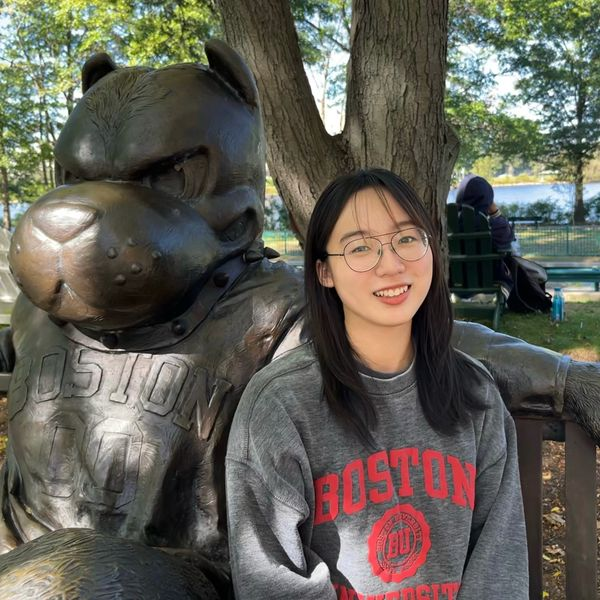
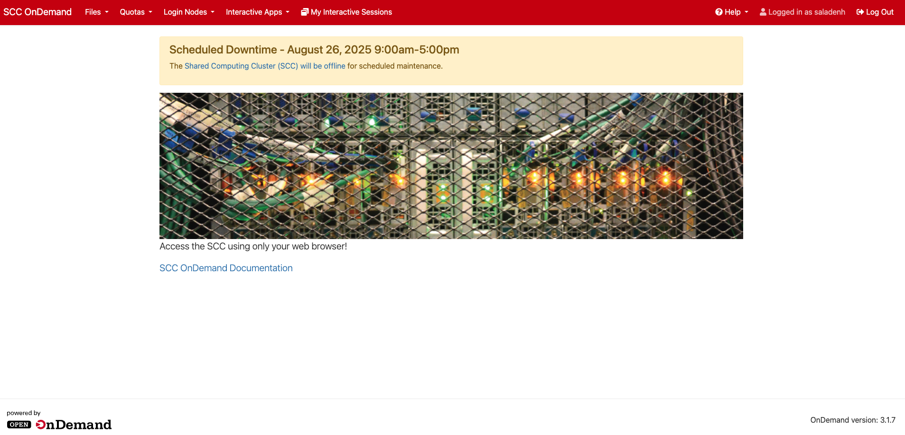
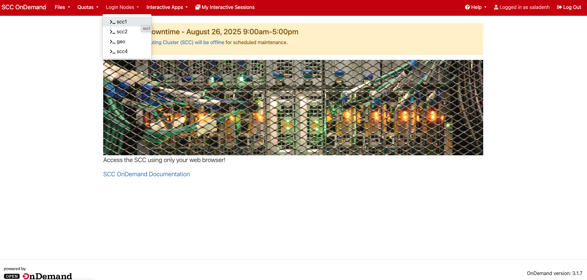
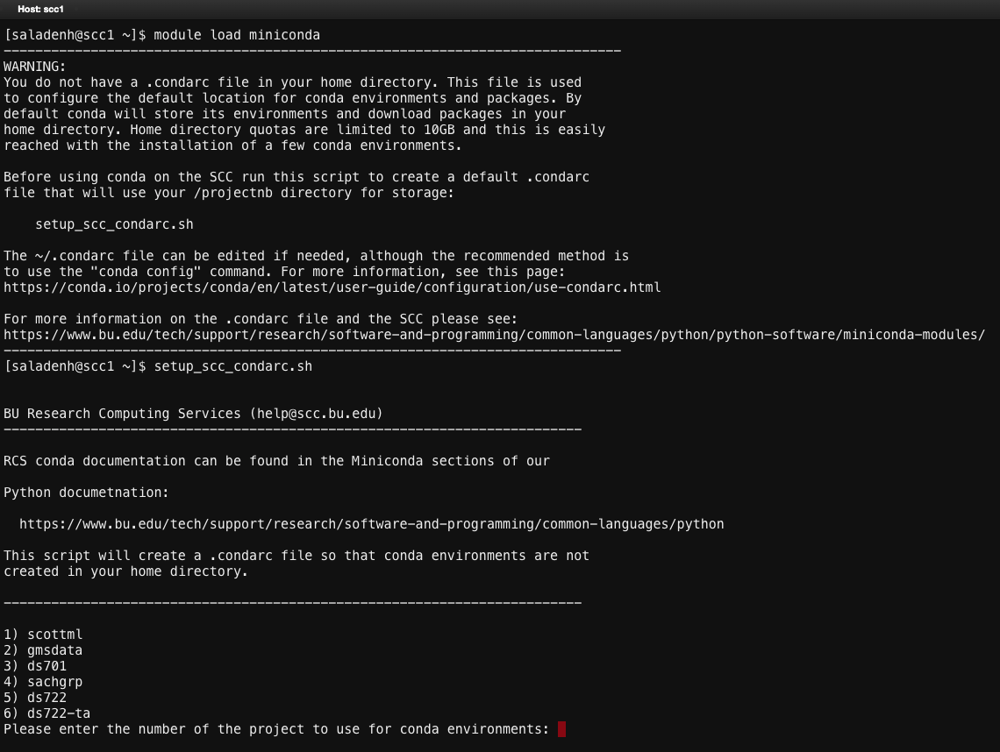
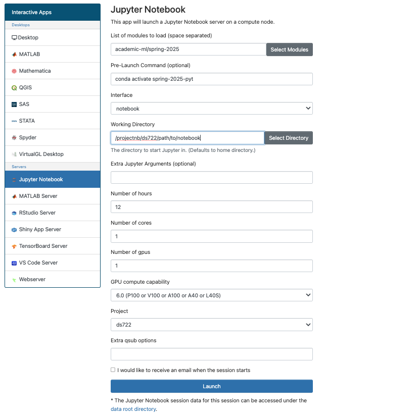

## Mathematical Foundations of DS

Welcome to DS722, Mathematical Foundations of DS.

Data science is a multidisciplinary field that combines mathematics, computer science, and domain expertise to extract insights and knowledge from data.

This is a Master's level introduction to the mathematical foundations that a data scientist needs.

::: {.notes}
Be sure to mention that this course will help them in their future courses. In particular, it will help them understand important notation and key ideas.

My goal is to push you to ensure you understand these ideas properly.
:::

## Why Mathematics Matters in DS

Mathematics is the backbone of data science. It helps us:

:::: {.incremental}
- Formulate models and algorithms that interpret data
- Understand the theoretical limits of what data can reveal
- Ensure robustness and reproducibility of results
- Analyze error bounds and optimize performance
::::

:::: {.fragment}
Without a solid mathematical foundation, it’s easy to misuse algorithms or misinterpret insights.
::::

::: {.notes}
Examples:
Linear regression
Neural networks
Which algorithms converge?
Examples: Gradient descent, Newton's method
:::

## Course Overview

In DS722 we'll explore:

- Linear algebra
- Optimization
- Probability and Statistics

:::: {.fragment}
Why these specific subjects?
::::

::: {.notes}
Mention each topic builds upon itself. It is essential to understand the early material in order to understand the later material.

Discuss what is covered in each section.
:::

## Neural Networks

Let's consider a neural network. Neural networks are a type of machine learning model that are inspired by the structure and function of the human brain. 

To understand how these models work requires a solid understanding of all three components of our course, namely, 

- linear algebra
- optimization
- probability/statistics

---

{fig-align="center"}

::: {.notes}
Consider a scenario where we are predicting whether a picture is cute/note cute.

Formulas to cover:

Forward propagation:
$$
a_{i}^{(l)} = \sigma\left(\sum_{j} w_{ij}^{(l)} a_{j}^{(l-1)} + b_i^{(l)}\right)
$$

Loss function:

$$
\mathcal{L}(y, \hat{y}) = -\sum_{i} y_i \log(\hat{y}_i),
$$
where $y$ is the true label and $\hat{y}$ is the predicted label. This loss is called the cross-entropy loss. It measures the difference between the true label and the predicted label.

Probability/statistics is used to interpret the output of the neural network and understand its uncertainty. For example, we can use Bayesian methods to estimate the uncertainty in the predictions made by the neural network.

Back propagation:

$$
\frac{\partial \mathcal{L}}{\partial w_{ij}^{(l)}} = \delta_i^{(l)} a_j^{(l-1)},
$$
where the error term $\delta_i^{(l)}$ is computed using the chain rule of calculus and represents how much the loss changes with respect to the weights.
:::

## Course Staff{.smaller}

:::: {.columns}
::: {.column width="48%"}
**Prof Scott Ladenheim** 

{width="300px" fig-align="center"}

* **OH:** M 3-4PM, Tu 10-11AM 
* **Location:** CDS 1545
* **Email:** saladenh &lt;at&gt; bu &lt;dot&gt; edu
:::

::: {.column width="48%"}
**Yuke Zhange** 

{width="210px" fig-align="center"}

* **OH:** TBD
* **Location:**  TBD
* **Email:** yukez &lt;at&gt; bu &lt;dot&gt; edu
:::
::::

## Course Resources

- Piazza: [piazza.com/bu/fall2026/ds722](https://piazza.com/bu/fall2026/ds722)
- [Gradescope](https://www.gradescope.com/)

::: {.notes}
Make sure to explain what is on Piazza and where things are located.
:::

## Course Books 

All course materials are available online or through the BU library.

- Numerical Linear Algebra, Trefethen & Bau  
- [Mathematical Methods in Data Science (with Python)](https://mmids-textbook.github.io/index.html), Roch  
- Numerical Optimization, Nocedal \& Wright
- [Mathematics for Machine Learning](https://mml-book.github.io/book/mml-book.pdf), Deisenroth, Faisal, Ong  
- All of Statistics: A concise course in statistical inference, Wasserman  
- [Probabilistic Machine Learning: An Introduction](https://probml.github.io/pml-book/book1.html), Murphy

::: {.notes}
Highlight which books are predominantly used. Mention that suggested reading is in the syllabus.
:::

## Grading Breakdown

Your grade is comprised of:

- Homework (15%)
- Discussion quizzes (25%)
- Discussion attendance (5%)
- Midterm (25%)
- Final (30%)

## Homework

- There are weekly problem sets with roughly 5 questions per assignment.

- Students are allotted a total of 5 late homework days throughout the semester, with a maximum of 2 days allowed per assignment. Late submissions beyond this policy will not be accepted.

::: {.notes}
Mention that HW will be more theoretical.
:::

## Discussions

- There are 12 discussion sections that occur each Thursday. 

- Attendance is recorded. Students may miss up to 3 sessions and still receive full participation credit. 

- If more than 3 discussions are missed, participation credit
will be prorated based on the percentage of sessions attended.

- During the semester will be 6 discussion quizzes consisting of 4 questions worth 20 points. 2 questions will be based on problems in the problem set. The other 2 questions will be unseen problems. 

- Non-quiz discussions sessions will work through computational problems using Jupyter notebooks. 

## Discussion Quizzes

::: {.notes}
Mention that discussions will be more computational.
:::

## Shared Computing Cluster

You have each been given an account on the BU Shared Computing Cluster (SCC). 

You may use this computational resource for both your homework assignments and discussion sections. 

I have included instructions for how to use the SCC on Piazza.

## SCC Overview

The SCC is a heterogeneous linux cluster.

The system currently includes:

- $>$12,000 CPU cores
- $>$400 GPUs
- $>$ 14 PB of storage

---

### Helpful Resources

Helpful information for the SCC can be found:

- General support information: [RCS Overview](https://www.bu.edu/tech/support/research/)
- [Linux Cheat Sheet](https://scv.bu.edu/documents/Linux_SCC_CheatSheet.pdf)
- [SCC Cheat Sheet](https://scv.bu.edu/documents/SCC_CheatSheet.pdf)

If you encounter any issues using the SCC direct questions to the teaching staff prior to reaching out to RCS help.

---

### Project ds722

All of your work can be done using the `ds722` project.

Each student has a small home directory located at `/projectnb/ds722/students/`
Each student has a 10 GB quota on their home directory.

Additional storage space can be used in `/projectnb/ds722/projects/`.

The discussion notebooks will become available in `/projectnb/ds722/materials/`.

---

### SCC OnDemand

Use the SCC through the [OnDemand](scc-ondemand.bu.edu) interface.

{fig-align="center"}

---

### Using Python

Please review the documentation for [using Python](https://www.bu.edu/tech/support/research/software-and-programming/common-languages/python/) on the SCC.

In particular read the information about the [Academic ML Environment](https://www.bu.edu/tech/support/research/software-and-programming/common-languages/python/python-ml/academic-machine-learning-environment/).

### Using conda on the SCC

Configure where your potential conda environments are stored using the command line.

{fig-align="center"}

---

:::: {.columns}
::: {.column width="45%"}
1. Run the command `module load miniconda`
1. Run the command `setup_scc_condarc.sh`
1. Input the number corresponding to the relevant project and hit enter
:::
::: {.column width="55%"}
{fig-align="center"}
:::
::::

---

### Jupyter Notebooks{.smaller}

::: {.columns}
::: {.column width="35%"}

- Select Jupyter Notebook from Interactive Apps.

- Fill in the options as shown in the figure.
:::
::: {.column width="65%"}
{fig-align="center"}
:::
:::

## Quick SCC Demo

Let me provide a quick SCC demo of how to use Jupyter on the SCC.

You will gain more experience doing this during the first discussion.

## Generative AI Policy

Your are not prevented from using Generative AI tools to help with your homework. However, since you are tested on the material in discussions and exams, it is best practice to work on the problems yourselves first in order to better understand the material.

---

### Your Responsibility

- You may use AI tools to explore and understand course material.
- AI should *support* your learning, not *replace* it.
- Your insights and problem-solving skills are what truly count.
  
Relying too heavily on tools without mastering concepts may affect your performance on the exams.

**Use AI as a learning aid—not a substitute for thinking.**

::: {.notes}
It is a very useful tool for helping you code/plot/visualize in discussion.
:::

## Academic Integrity

Discussion with classmates is permitted,  
but copying answers or plagiarizing is strictly prohibited.

Your submitted work must your own.  
All members of the class—including teaching staff—must uphold the [Academic Code of Conduct](http://www.bu.edu/dos/policies/student-responsibilities/)

## Getting Help

1. **Stuck on where to begin?**  
   Reach out to a TF or post on Piazza. You’ll often get helpful guidance quickly.

1. **Trying to validate your solution?**  
   Can you find a way to verify your solution without google or AI assistance? That’s a powerful learning opportunity.

1. **Visit me in office hours.**  
   I’m happy to discuss your approach, clarify concepts, and provide feedback.

## Math is Fun
  
I’m excited to teach you about the world of mathematics and data science.

Feel free to ask questions, share your thoughts, and challenge ideas.  
Your curiosity is the key to a great learning experience!

_You’re not just here to absorb knowledge—you’re here to apply it, explore it, and transform it._

## Next Class

We will introduce:

- Mathematical notation 
- Logic 
- Proofs
- Vectors

Have a nice weekend!